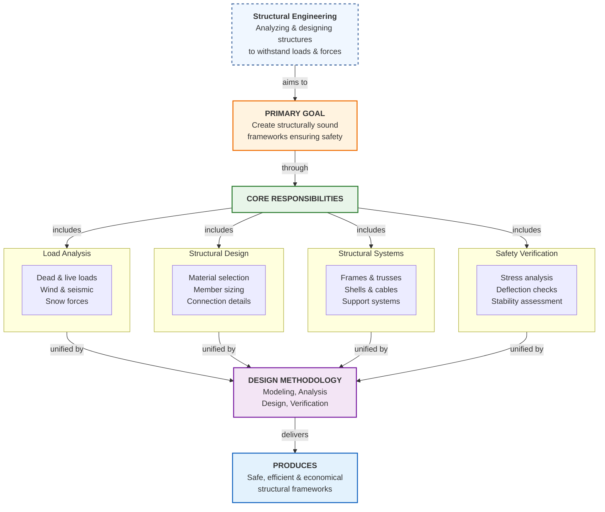

```mermaid
flowchart TD
    A[<b>Structural Engineering</b><br>Analyzing & designing structures<br>to withstand loads & forces]:::title
    B[<b>PRIMARY GOAL</b><br>Create structurally sound<br>frameworks ensuring safety]:::goal
    C[<b>CORE RESPONSIBILITIES</b>]:::responsibilities
    
    subgraph D[Load Analysis]
        D1[Dead & live loads<br>Wind & seismic<br>Snow forces]
    end
    
    subgraph E[Structural Design]
        E1[Material selection<br>Member sizing<br>Connection details]
    end
    
    subgraph F[Structural Systems]
        F1[Frames & trusses<br>Shells & cables<br>Support systems]
    end
    
    subgraph G[Safety Verification]
        G1[Stress analysis<br>Deflection checks<br>Stability assessment]
    end
    
    H[<b>DESIGN METHODOLOGY</b><br>Modeling, Analysis<br>Design, Verification]:::methodology
    
    I[<b>PRODUCES</b><br>Safe, efficient & economical<br>structural frameworks]:::outcome
    
    A -->|aims to| B
    B -->|through| C
    C -->|includes| D
    C -->|includes| E
    C -->|includes| F
    C -->|includes| G
    D & E & F & G -->|unified by| H
    H -->|delivers| I
    
    classDef title fill:#f0f7ff,stroke:#4a6fa5,stroke-width:2px,color:#333,stroke-dasharray: 5 5
    classDef goal fill:#fff3e0,stroke:#ef6c00,stroke-width:2px,color:#333
    classDef responsibilities fill:#e8f5e9,stroke:#2e7d32,stroke-width:2px,color:#333
    classDef methodology fill:#f3e5f5,stroke:#7b1fa2,stroke-width:2px,color:#333
    classDef outcome fill:#e3f2fd,stroke:#1565c0,stroke-width:2px,color:#333
```
