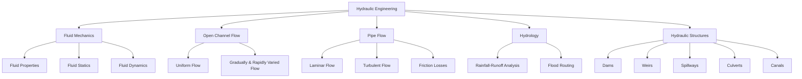

```mermaid
flowchart TD
    HE[Hydraulic Engineering] --> FluidMechanics[Fluid Mechanics]
    HE --> OpenChannel[Open Channel Flow]
    HE --> PipeFlow[Pipe Flow]
    HE --> Hydrology[Hydrology]
    HE --> Structures[Hydraulic Structures]

    FluidMechanics --> Properties[Fluid Properties]
    FluidMechanics --> Statics[Fluid Statics]
    FluidMechanics --> Dynamics[Fluid Dynamics]

    OpenChannel --> Uniform[Uniform Flow]
    OpenChannel --> Varied[Gradually & Rapidly Varied Flow]

    PipeFlow --> Laminar[Laminar Flow]
    PipeFlow --> Turbulent[Turbulent Flow]
    PipeFlow --> Friction[Friction Losses]

    Hydrology --> Rainfall[Rainfall-Runoff Analysis]
    Hydrology --> Floods[Flood Routing]

    Structures --> Dams[Dams]
    Structures --> Weirs[Weirs]
    Structures --> Spillways[Spillways]
    Structures --> Culverts[Culverts]
    Structures --> Canals[Canals]
```
