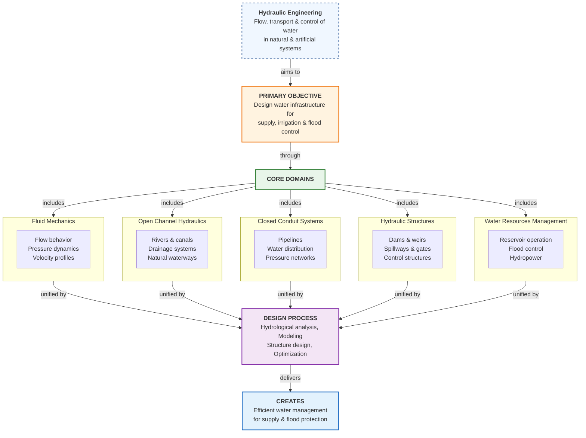

```mermaid
flowchart TD
    A[<b>Hydraulic Engineering</b><br>Flow, transport & control of water<br>in natural & artificial systems]:::title
    B[<b>PRIMARY OBJECTIVE</b><br>Design water infrastructure for<br>supply, irrigation & flood control]:::objective
    C[<b>CORE DOMAINS</b>]:::domains
    
    subgraph D[Fluid Mechanics]
        D1[Flow behavior<br>Pressure dynamics<br>Velocity profiles]
    end
    
    subgraph E[Open Channel Hydraulics]
        E1[Rivers & canals<br>Drainage systems<br>Natural waterways]
    end
    
    subgraph F[Closed Conduit Systems]
        F1[Pipelines<br>Water distribution<br>Pressure networks]
    end
    
    subgraph G[Hydraulic Structures]
        G1[Dams & weirs<br>Spillways & gates<br>Control structures]
    end
    
    subgraph H[Water Resources Management]
        H1[Reservoir operation<br>Flood control<br>Hydropower]
    end
    
    I[<b>DESIGN PROCESS</b><br>Hydrological analysis, Modeling<br>Structure design, Optimization]:::process
    
    J[<b>CREATES</b><br>Efficient water management<br>for supply & flood protection]:::outcome
    
    A -->|aims to| B
    B -->|through| C
    C -->|includes| D
    C -->|includes| E
    C -->|includes| F
    C -->|includes| G
    C -->|includes| H
    D & E & F & G & H -->|unified by| I
    I -->|delivers| J
    
    classDef title fill:#f0f7ff,stroke:#4a6fa5,stroke-width:2px,color:#333,stroke-dasharray: 5 5
    classDef objective fill:#fff3e0,stroke:#ef6c00,stroke-width:2px,color:#333
    classDef domains fill:#e8f5e9,stroke:#2e7d32,stroke-width:2px,color:#333
    classDef process fill:#f3e5f5,stroke:#7b1fa2,stroke-width:2px,color:#333
    classDef outcome fill:#e3f2fd,stroke:#1565c0,stroke-width:2px,color:#333
```
