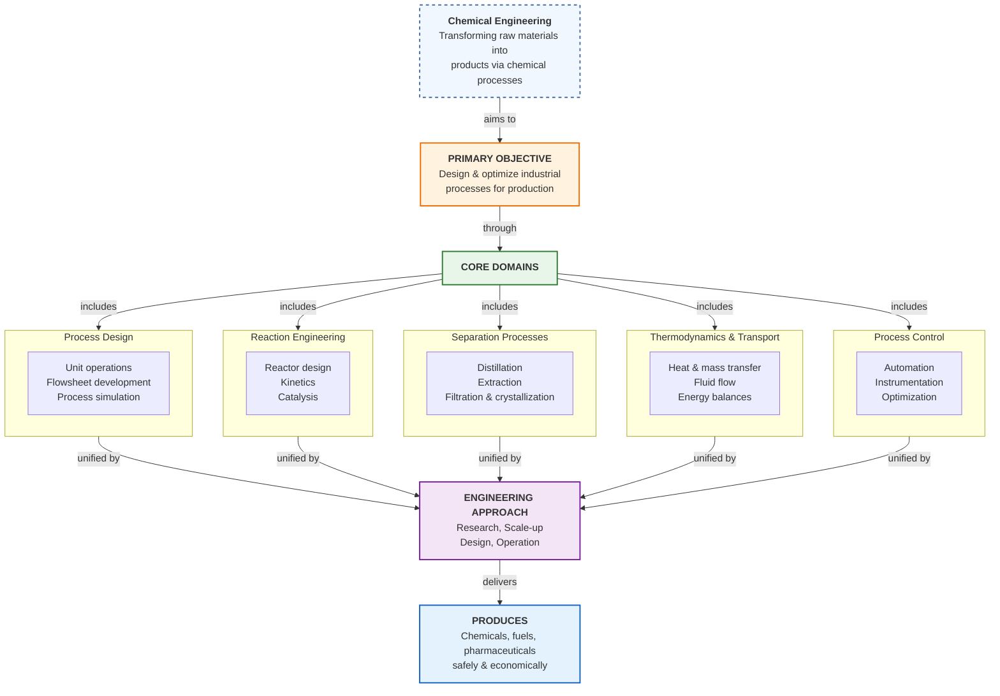

```mermaid
flowchart TD
    A[<b>Chemical Engineering</b><br>Transforming raw materials into<br>products via chemical processes]:::title
    B[<b>PRIMARY OBJECTIVE</b><br>Design & optimize industrial<br>processes for production]:::objective
    C[<b>CORE DOMAINS</b>]:::domains
    
    subgraph D[Process Design]
        D1[Unit operations<br>Flowsheet development<br>Process simulation]
    end
    
    subgraph E[Reaction Engineering]
        E1[Reactor design<br>Kinetics<br>Catalysis]
    end
    
    subgraph F[Separation Processes]
        F1[Distillation<br>Extraction<br>Filtration & crystallization]
    end
    
    subgraph G[Thermodynamics & Transport]
        G1[Heat & mass transfer<br>Fluid flow<br>Energy balances]
    end
    
    subgraph H[Process Control]
        H1[Automation<br>Instrumentation<br>Optimization]
    end
    
    I[<b>ENGINEERING APPROACH</b><br>Research, Scale-up<br>Design, Operation]:::approach
    
    J[<b>PRODUCES</b><br>Chemicals, fuels, pharmaceuticals<br>safely & economically]:::outcome
    
    A -->|aims to| B
    B -->|through| C
    C -->|includes| D
    C -->|includes| E
    C -->|includes| F
    C -->|includes| G
    C -->|includes| H
    D & E & F & G & H -->|unified by| I
    I -->|delivers| J
    
    classDef title fill:#f0f7ff,stroke:#4a6fa5,stroke-width:2px,color:#333,stroke-dasharray: 5 5
    classDef objective fill:#fff3e0,stroke:#ef6c00,stroke-width:2px,color:#333
    classDef domains fill:#e8f5e9,stroke:#2e7d32,stroke-width:2px,color:#333
    classDef approach fill:#f3e5f5,stroke:#7b1fa2,stroke-width:2px,color:#333
    classDef outcome fill:#e3f2fd,stroke:#1565c0,stroke-width:2px,color:#333
```
