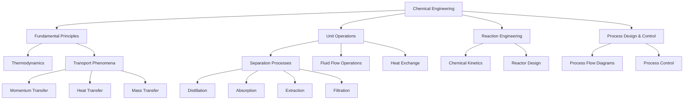

```mermaid
flowchart TD
    ChE[Chemical Engineering] --> Principles[Fundamental Principles]
    ChE --> UnitOps[Unit Operations]
    ChE --> ReactionEng[Reaction Engineering]
    ChE --> ProcessDesign[Process Design & Control]

    Principles --> Thermo[Thermodynamics]
    Principles --> Transport[Transport Phenomena]

    Transport --> Momentum[Momentum Transfer]
    Transport --> Heat[Heat Transfer]
    Transport --> Mass[Mass Transfer]

    UnitOps --> Separation[Separation Processes]
    UnitOps --> FluidFlow[Fluid Flow Operations]
    UnitOps --> HeatEx[Heat Exchange]

    Separation --> Distillation[Distillation]
    Separation --> Absorption[Absorption]
    Separation --> Extraction[Extraction]
    Separation --> Filtration[Filtration]

    ReactionEng --> Kinetics[Chemical Kinetics]
    ReactionEng --> ReactorDesign[Reactor Design]

    ProcessDesign --> PFDs[Process Flow Diagrams]
    ProcessDesign --> ControlSystems[Process Control]
```
