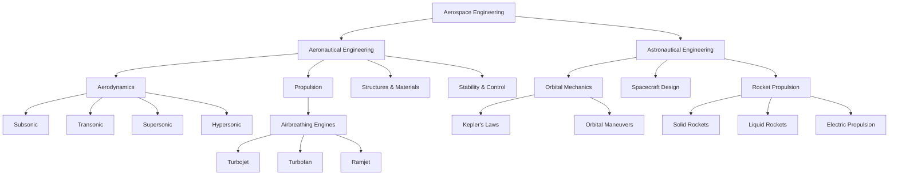

```mermaid
flowchart TD
    AE[Aerospace Engineering] --> Aeronautical[Aeronautical Engineering]
    AE --> Astronautical[Astronautical Engineering]

    Aeronautical --> Aerodynamics[Aerodynamics]
    Aeronautical --> Propulsion[Propulsion]
    Aeronautical --> Structures[Structures & Materials]
    Aeronautical --> Stability[Stability & Control]

    Aerodynamics --> Subsonic[Subsonic]
    Aerodynamics --> Transonic[Transonic]
    Aerodynamics --> Supersonic[Supersonic]
    Aerodynamics --> Hypersonic[Hypersonic]

    Propulsion --> Airbreathing[Airbreathing Engines]
    Airbreathing --> Turbojet[Turbojet]
    Airbreathing --> Turbofan[Turbofan]
    Airbreathing --> Ramjet[Ramjet]

    Astronautical --> Orbital[Orbital Mechanics]
    Astronautical --> Spacecraft[Spacecraft Design]
    Astronautical --> Rocket[Rocket Propulsion]

    Orbital --> Kepler[Kepler's Laws]
    Orbital --> Maneuvers[Orbital Maneuvers]

    Rocket --> Solid[Solid Rockets]
    Rocket --> Liquid[Liquid Rockets]
    Rocket --> Electric[Electric Propulsion]
```
