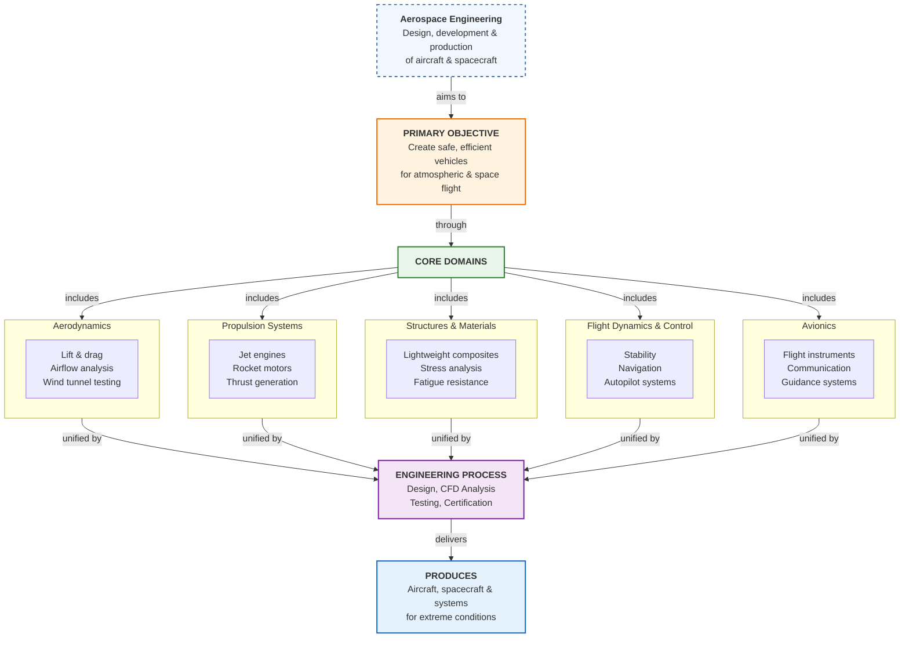

```mermaid
flowchart TD
    A[<b>Aerospace Engineering</b><br>Design, development & production<br>of aircraft & spacecraft]:::title
    B[<b>PRIMARY OBJECTIVE</b><br>Create safe, efficient vehicles<br>for atmospheric & space flight]:::objective
    C[<b>CORE DOMAINS</b>]:::domains
    
    subgraph D[Aerodynamics]
        D1[Lift & drag<br>Airflow analysis<br>Wind tunnel testing]
    end
    
    subgraph E[Propulsion Systems]
        E1[Jet engines<br>Rocket motors<br>Thrust generation]
    end
    
    subgraph F[Structures & Materials]
        F1[Lightweight composites<br>Stress analysis<br>Fatigue resistance]
    end
    
    subgraph G[Flight Dynamics & Control]
        G1[Stability<br>Navigation<br>Autopilot systems]
    end
    
    subgraph H[Avionics]
        H1[Flight instruments<br>Communication<br>Guidance systems]
    end
    
    I[<b>ENGINEERING PROCESS</b><br>Design, CFD Analysis<br>Testing, Certification]:::process
    
    J[<b>PRODUCES</b><br>Aircraft, spacecraft & systems<br>for extreme conditions]:::outcome
    
    A -->|aims to| B
    B -->|through| C
    C -->|includes| D
    C -->|includes| E
    C -->|includes| F
    C -->|includes| G
    C -->|includes| H
    D & E & F & G & H -->|unified by| I
    I -->|delivers| J
    
    classDef title fill:#f0f7ff,stroke:#4a6fa5,stroke-width:2px,color:#333,stroke-dasharray: 5 5
    classDef objective fill:#fff3e0,stroke:#ef6c00,stroke-width:2px,color:#333
    classDef domains fill:#e8f5e9,stroke:#2e7d32,stroke-width:2px,color:#333
    classDef process fill:#f3e5f5,stroke:#7b1fa2,stroke-width:2px,color:#333
    classDef outcome fill:#e3f2fd,stroke:#1565c0,stroke-width:2px,color:#333
```
