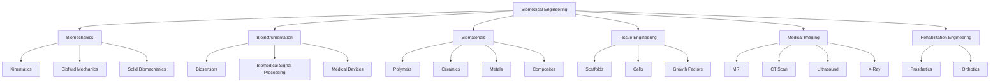

```mermaid
flowchart TD
    BME[Biomedical Engineering] --> Biomechanics[Biomechanics]
    BME --> Bioinstrumentation[Bioinstrumentation]
    BME --> Biomaterials[Biomaterials]
    BME --> TissueEng[Tissue Engineering]
    BME --> MedicalImaging[Medical Imaging]
    BME --> Rehab[Rehabilitation Engineering]

    Biomechanics --> Kinematics[Kinematics]
    Biomechanics --> Fluid[Biofluid Mechanics]
    Biomechanics --> Solid[Solid Biomechanics]

    Bioinstrumentation --> Sensors[Biosensors]
    Bioinstrumentation --> SignalProcessing[Biomedical Signal Processing]
    Bioinstrumentation --> Devices[Medical Devices]

    Biomaterials --> Polymers[Polymers]
    Biomaterials --> Ceramics[Ceramics]
    Biomaterials --> Metals[Metals]
    Biomaterials --> Composites[Composites]

    TissueEng --> Scaffolds[Scaffolds]
    TissueEng --> Cells[Cells]
    TissueEng --> GrowthFactors[Growth Factors]

    MedicalImaging --> MRI[MRI]
    MedicalImaging --> CT[CT Scan]
    MedicalImaging --> Ultrasound[Ultrasound]
    MedicalImaging --> XRay[X-Ray]

    Rehab --> Prosthetics[Prosthetics]
    Rehab --> Orthotics[Orthotics]
```
