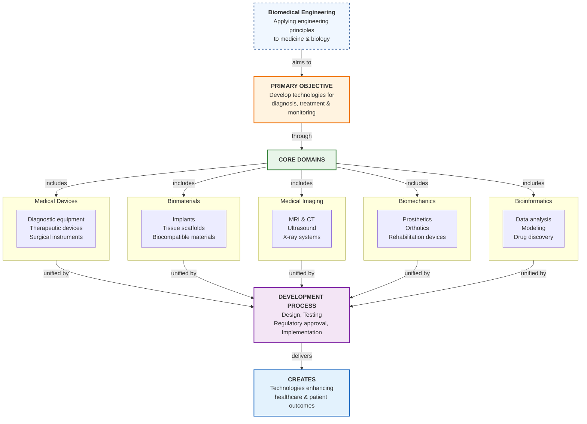

```mermaid
flowchart TD
    A[<b>Biomedical Engineering</b><br>Applying engineering principles<br>to medicine & biology]:::title
    B[<b>PRIMARY OBJECTIVE</b><br>Develop technologies for<br>diagnosis, treatment & monitoring]:::objective
    C[<b>CORE DOMAINS</b>]:::domains
    
    subgraph D[Medical Devices]
        D1[Diagnostic equipment<br>Therapeutic devices<br>Surgical instruments]
    end
    
    subgraph E[Biomaterials]
        E1[Implants<br>Tissue scaffolds<br>Biocompatible materials]
    end
    
    subgraph F[Medical Imaging]
        F1[MRI & CT<br>Ultrasound<br>X-ray systems]
    end
    
    subgraph G[Biomechanics]
        G1[Prosthetics<br>Orthotics<br>Rehabilitation devices]
    end
    
    subgraph H[Bioinformatics]
        H1[Data analysis<br>Modeling<br>Drug discovery]
    end
    
    I[<b>DEVELOPMENT PROCESS</b><br>Design, Testing<br>Regulatory approval, Implementation]:::process
    
    J[<b>CREATES</b><br>Technologies enhancing<br>healthcare & patient outcomes]:::outcome
    
    A -->|aims to| B
    B -->|through| C
    C -->|includes| D
    C -->|includes| E
    C -->|includes| F
    C -->|includes| G
    C -->|includes| H
    D & E & F & G & H -->|unified by| I
    I -->|delivers| J
    
    classDef title fill:#f0f7ff,stroke:#4a6fa5,stroke-width:2px,color:#333,stroke-dasharray: 5 5
    classDef objective fill:#fff3e0,stroke:#ef6c00,stroke-width:2px,color:#333
    classDef domains fill:#e8f5e9,stroke:#2e7d32,stroke-width:2px,color:#333
    classDef process fill:#f3e5f5,stroke:#7b1fa2,stroke-width:2px,color:#333
    classDef outcome fill:#e3f2fd,stroke:#1565c0,stroke-width:2px,color:#333
```
