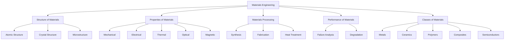

```mermaid
flowchart TD
    MatE[Materials Engineering] --> Structure[Structure of Materials]
    MatE --> Properties[Properties of Materials]
    MatE --> Processing[Materials Processing]
    MatE --> Performance[Performance of Materials]
    MatE --> Classes[Classes of Materials]

    Structure --> Atomic[Atomic Structure]
    Structure --> Crystal[Crystal Structure]
    Structure --> Microstructure[Microstructure]

    Properties --> Mechanical[Mechanical]
    Properties --> Electrical[Electrical]
    Properties --> Thermal[Thermal]
    Properties --> Optical[Optical]
    Properties --> Magnetic[Magnetic]

    Processing --> Synthesis[Synthesis]
    Processing --> Fabrication[Fabrication]
    Processing --> HeatTreatment[Heat Treatment]

    Performance --> Failure[Failure Analysis]
    Performance --> Degradation[Degradation]

    Classes --> Metals[Metals]
    Classes --> Ceramics[Ceramics]
    Classes --> Polymers[Polymers]
    Classes --> Composites[Composites]
    Classes --> Semiconductors[Semiconductors]
```
