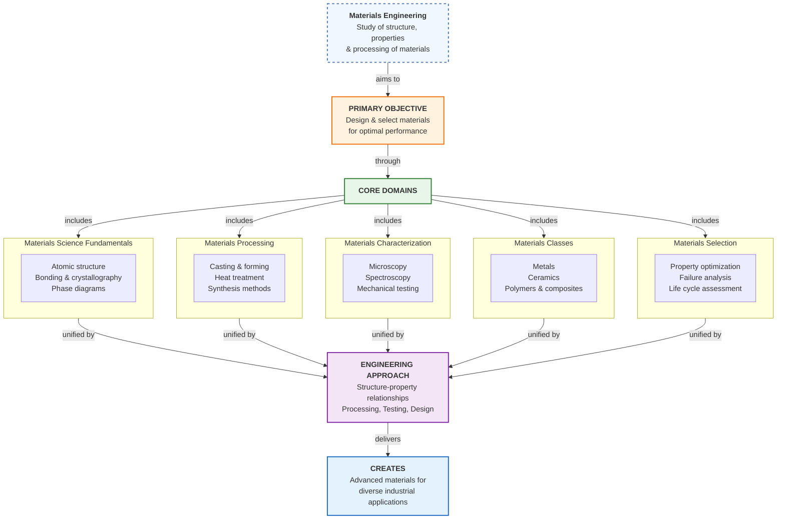

```mermaid
flowchart TD
    A[<b>Materials Engineering</b><br>Study of structure, properties<br>& processing of materials]:::title
    B[<b>PRIMARY OBJECTIVE</b><br>Design & select materials<br>for optimal performance]:::objective
    C[<b>CORE DOMAINS</b>]:::domains
    
    subgraph D[Materials Science Fundamentals]
        D1[Atomic structure<br>Bonding & crystallography<br>Phase diagrams]
    end
    
    subgraph E[Materials Processing]
        E1[Casting & forming<br>Heat treatment<br>Synthesis methods]
    end
    
    subgraph F[Materials Characterization]
        F1[Microscopy<br>Spectroscopy<br>Mechanical testing]
    end
    
    subgraph G[Materials Classes]
        G1[Metals<br>Ceramics<br>Polymers & composites]
    end
    
    subgraph H[Materials Selection]
        H1[Property optimization<br>Failure analysis<br>Life cycle assessment]
    end
    
    I[<b>ENGINEERING APPROACH</b><br>Structure-property relationships<br>Processing, Testing, Design]:::approach
    
    J[<b>CREATES</b><br>Advanced materials for<br>diverse industrial applications]:::outcome
    
    A -->|aims to| B
    B -->|through| C
    C -->|includes| D
    C -->|includes| E
    C -->|includes| F
    C -->|includes| G
    C -->|includes| H
    D & E & F & G & H -->|unified by| I
    I -->|delivers| J
    
    classDef title fill:#f0f7ff,stroke:#4a6fa5,stroke-width:2px,color:#333,stroke-dasharray: 5 5
    classDef objective fill:#fff3e0,stroke:#ef6c00,stroke-width:2px,color:#333
    classDef domains fill:#e8f5e9,stroke:#2e7d32,stroke-width:2px,color:#333
    classDef approach fill:#f3e5f5,stroke:#7b1fa2,stroke-width:2px,color:#333
    classDef outcome fill:#e3f2fd,stroke:#1565c0,stroke-width:2px,color:#333
```
