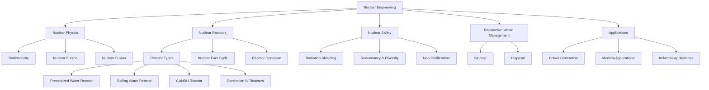

```mermaid
flowchart TD
    NE[Nuclear Engineering] --> Physics[Nuclear Physics]
    NE --> Reactors[Nuclear Reactors]
    NE --> Safety[Nuclear Safety]
    NE --> Waste[Radioactive Waste Management]
    NE --> Applications[Applications]

    Physics --> Radioactivity[Radioactivity]
    Physics --> Fission[Nuclear Fission]
    Physics --> Fusion[Nuclear Fusion]

    Reactors --> Types[Reactor Types]
    Reactors --> Fuel[Nuclear Fuel Cycle]
    Reactors --> Operation[Reactor Operation]

    Types --> PWR[Pressurized Water Reactor]
    Types --> BWR[Boiling Water Reactor]
    Types --> CANDU[CANDU Reactor]
    Types --> GenIV[Generation IV Reactors]

    Safety --> Shielding[Radiation Shielding]
    Safety --> Redundancy[Redundancy & Diversity]
    Safety --> Proliferation[Non-Proliferation]

    Waste --> Storage[Storage]
    Waste --> Disposal[Disposal]

    Applications --> Power[Power Generation]
    Applications --> Medicine[Medical Applications]
    Applications --> Industry[Industrial Applications]
```
