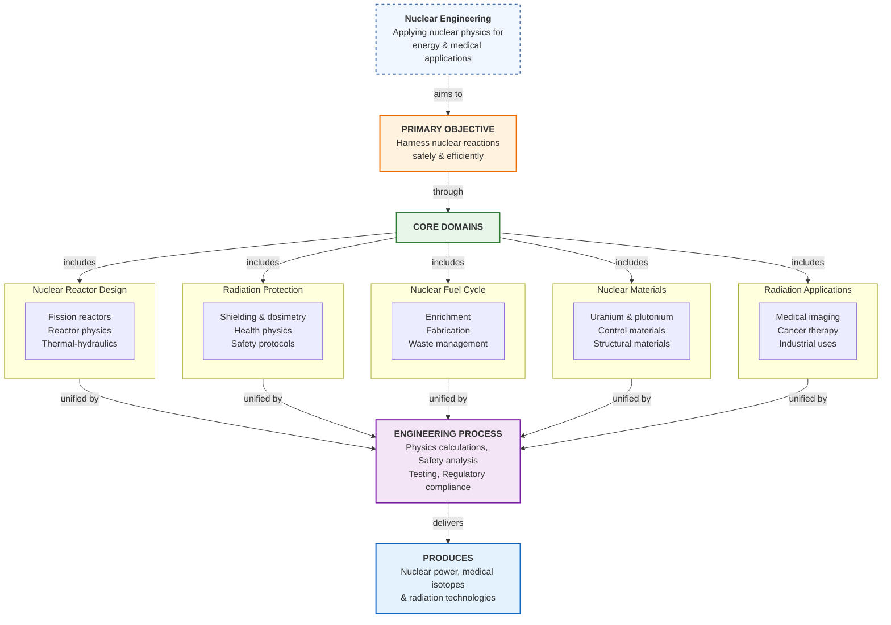

```mermaid
flowchart TD
    A[<b>Nuclear Engineering</b><br>Applying nuclear physics for<br>energy & medical applications]:::title
    B[<b>PRIMARY OBJECTIVE</b><br>Harness nuclear reactions<br>safely & efficiently]:::objective
    C[<b>CORE DOMAINS</b>]:::domains
    
    subgraph D[Nuclear Reactor Design]
        D1[Fission reactors<br>Reactor physics<br>Thermal-hydraulics]
    end
    
    subgraph E[Radiation Protection]
        E1[Shielding & dosimetry<br>Health physics<br>Safety protocols]
    end
    
    subgraph F[Nuclear Fuel Cycle]
        F1[Enrichment<br>Fabrication<br>Waste management]
    end
    
    subgraph G[Nuclear Materials]
        G1[Uranium & plutonium<br>Control materials<br>Structural materials]
    end
    
    subgraph H[Radiation Applications]
        H1[Medical imaging<br>Cancer therapy<br>Industrial uses]
    end
    
    I[<b>ENGINEERING PROCESS</b><br>Physics calculations, Safety analysis<br>Testing, Regulatory compliance]:::process
    
    J[<b>PRODUCES</b><br>Nuclear power, medical isotopes<br>& radiation technologies]:::outcome
    
    A -->|aims to| B
    B -->|through| C
    C -->|includes| D
    C -->|includes| E
    C -->|includes| F
    C -->|includes| G
    C -->|includes| H
    D & E & F & G & H -->|unified by| I
    I -->|delivers| J
    
    classDef title fill:#f0f7ff,stroke:#4a6fa5,stroke-width:2px,color:#333,stroke-dasharray: 5 5
    classDef objective fill:#fff3e0,stroke:#ef6c00,stroke-width:2px,color:#333
    classDef domains fill:#e8f5e9,stroke:#2e7d32,stroke-width:2px,color:#333
    classDef process fill:#f3e5f5,stroke:#7b1fa2,stroke-width:2px,color:#333
    classDef outcome fill:#e3f2fd,stroke:#1565c0,stroke-width:2px,color:#333
```
