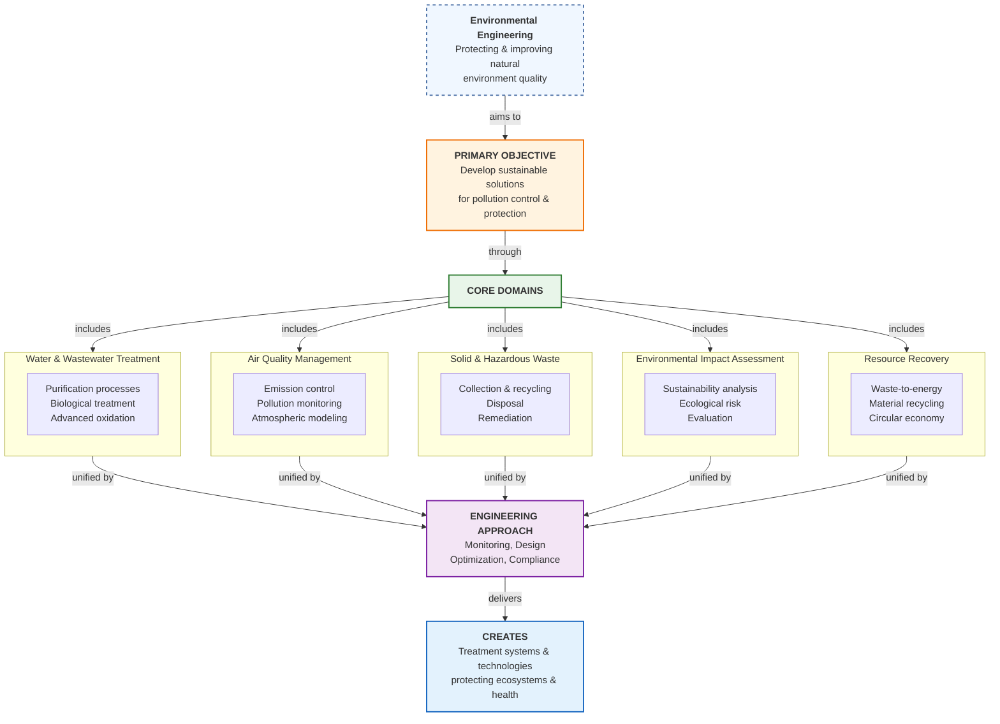

```mermaid
flowchart TD
    A[<b>Environmental Engineering</b><br>Protecting & improving natural<br>environment quality]:::title
    B[<b>PRIMARY OBJECTIVE</b><br>Develop sustainable solutions<br>for pollution control & protection]:::objective
    C[<b>CORE DOMAINS</b>]:::domains
    
    subgraph D[Water & Wastewater Treatment]
        D1[Purification processes<br>Biological treatment<br>Advanced oxidation]
    end
    
    subgraph E[Air Quality Management]
        E1[Emission control<br>Pollution monitoring<br>Atmospheric modeling]
    end
    
    subgraph F[Solid & Hazardous Waste]
        F1[Collection & recycling<br>Disposal<br>Remediation]
    end
    
    subgraph G[Environmental Impact Assessment]
        G1[Sustainability analysis<br>Ecological risk<br>Evaluation]
    end
    
    subgraph H[Resource Recovery]
        H1[Waste-to-energy<br>Material recycling<br>Circular economy]
    end
    
    I[<b>ENGINEERING APPROACH</b><br>Monitoring, Design<br>Optimization, Compliance]:::approach
    
    J[<b>CREATES</b><br>Treatment systems & technologies<br>protecting ecosystems & health]:::outcome
    
    A -->|aims to| B
    B -->|through| C
    C -->|includes| D
    C -->|includes| E
    C -->|includes| F
    C -->|includes| G
    C -->|includes| H
    D & E & F & G & H -->|unified by| I
    I -->|delivers| J
    
    classDef title fill:#f0f7ff,stroke:#4a6fa5,stroke-width:2px,color:#333,stroke-dasharray: 5 5
    classDef objective fill:#fff3e0,stroke:#ef6c00,stroke-width:2px,color:#333
    classDef domains fill:#e8f5e9,stroke:#2e7d32,stroke-width:2px,color:#333
    classDef approach fill:#f3e5f5,stroke:#7b1fa2,stroke-width:2px,color:#333
    classDef outcome fill:#e3f2fd,stroke:#1565c0,stroke-width:2px,color:#333
```
