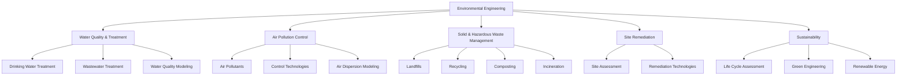

```mermaid
flowchart TD
    EnvE[Environmental Engineering] --> Water[Water Quality & Treatment]
    EnvE --> Air[Air Pollution Control]
    EnvE --> Waste[Solid & Hazardous Waste Management]
    EnvE --> Site[Site Remediation]
    EnvE --> Sustainability[Sustainability]

    Water --> DrinkingWater[Drinking Water Treatment]
    Water --> Wastewater[Wastewater Treatment]
    Water --> WaterQuality[Water Quality Modeling]

    Air --> Pollutants[Air Pollutants]
    Air --> ControlTech[Control Technologies]
    Air --> Modeling[Air Dispersion Modeling]

    Waste --> Landfills[Landfills]
    Waste --> Recycling[Recycling]
    Waste --> Composting[Composting]
    Waste --> Incineration[Incineration]

    Site --> Assessment[Site Assessment]
    Site --> RemediationTech[Remediation Technologies]

    Sustainability --> LCA[Life Cycle Assessment]
    Sustainability --> Green[Green Engineering]
    Sustainability --> Renewable[Renewable Energy]
```
