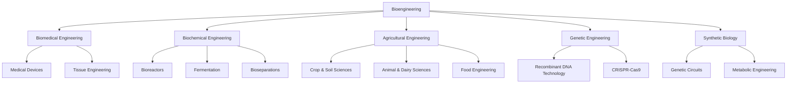

```mermaid
flowchart TD
    BioE[Bioengineering] --> BME[Biomedical Engineering]
    BioE --> BiochemE[Biochemical Engineering]
    BioE --> AgE[Agricultural Engineering]
    BioE --> GeneticE[Genetic Engineering]
    BioE --> SyntheticBio[Synthetic Biology]

    BME --> MedicalDevices[Medical Devices]
    BME --> TissueEng[Tissue Engineering]

    BiochemE --> Bioreactors[Bioreactors]
    BiochemE --> Fermentation[Fermentation]
    BiochemE --> Bioseparations[Bioseparations]

    AgE --> Crop[Crop & Soil Sciences]
    AgE --> Animal[Animal & Dairy Sciences]
    AgE --> Food[Food Engineering]

    GeneticE --> RecombinantDNA[Recombinant DNA Technology]
    GeneticE --> CRISPR[CRISPR-Cas9]

    SyntheticBio --> GeneticCircuits[Genetic Circuits]
    SyntheticBio --> MetabolicEng[Metabolic Engineering]
```
