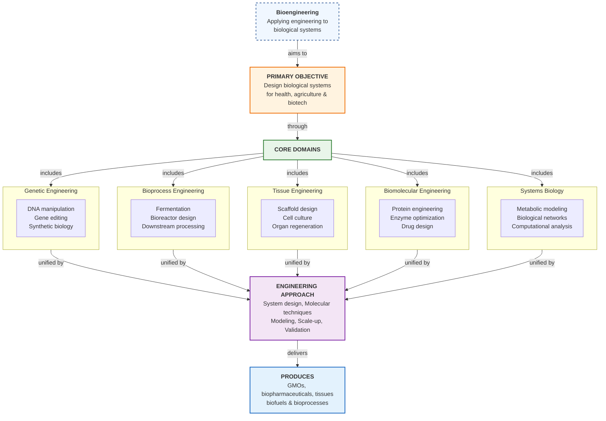

```mermaid
flowchart TD
    A[<b>Bioengineering</b><br>Applying engineering to<br>biological systems]:::title
    B[<b>PRIMARY OBJECTIVE</b><br>Design biological systems<br>for health, agriculture & biotech]:::objective
    C[<b>CORE DOMAINS</b>]:::domains
    
    subgraph D[Genetic Engineering]
        D1[DNA manipulation<br>Gene editing<br>Synthetic biology]
    end
    
    subgraph E[Bioprocess Engineering]
        E1[Fermentation<br>Bioreactor design<br>Downstream processing]
    end
    
    subgraph F[Tissue Engineering]
        F1[Scaffold design<br>Cell culture<br>Organ regeneration]
    end
    
    subgraph G[Biomolecular Engineering]
        G1[Protein engineering<br>Enzyme optimization<br>Drug design]
    end
    
    subgraph H[Systems Biology]
        H1[Metabolic modeling<br>Biological networks<br>Computational analysis]
    end
    
    I[<b>ENGINEERING APPROACH</b><br>System design, Molecular techniques<br>Modeling, Scale-up, Validation]:::approach
    
    J[<b>PRODUCES</b><br>GMOs, biopharmaceuticals, tissues<br>biofuels & bioprocesses]:::outcome
    
    A -->|aims to| B
    B -->|through| C
    C -->|includes| D
    C -->|includes| E
    C -->|includes| F
    C -->|includes| G
    C -->|includes| H
    D & E & F & G & H -->|unified by| I
    I -->|delivers| J
    
    classDef title fill:#f0f7ff,stroke:#4a6fa5,stroke-width:2px,color:#333,stroke-dasharray: 5 5
    classDef objective fill:#fff3e0,stroke:#ef6c00,stroke-width:2px,color:#333
    classDef domains fill:#e8f5e9,stroke:#2e7d32,stroke-width:2px,color:#333
    classDef approach fill:#f3e5f5,stroke:#7b1fa2,stroke-width:2px,color:#333
    classDef outcome fill:#e3f2fd,stroke:#1565c0,stroke-width:2px,color:#333
```
