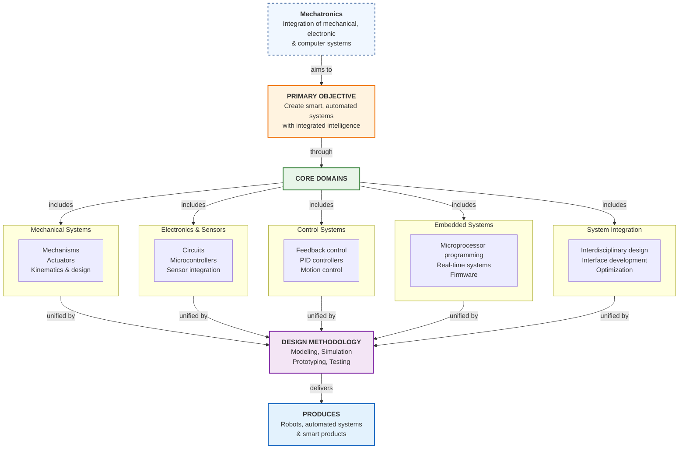

```mermaid
flowchart TD
    A[<b>Mechatronics</b><br>Integration of mechanical, electronic<br>& computer systems]:::title
    B[<b>PRIMARY OBJECTIVE</b><br>Create smart, automated systems<br>with integrated intelligence]:::objective
    C[<b>CORE DOMAINS</b>]:::domains
    
    subgraph D[Mechanical Systems]
        D1[Mechanisms<br>Actuators<br>Kinematics & design]
    end
    
    subgraph E[Electronics & Sensors]
        E1[Circuits<br>Microcontrollers<br>Sensor integration]
    end
    
    subgraph F[Control Systems]
        F1[Feedback control<br>PID controllers<br>Motion control]
    end
    
    subgraph G[Embedded Systems]
        G1[Microprocessor programming<br>Real-time systems<br>Firmware]
    end
    
    subgraph H[System Integration]
        H1[Interdisciplinary design<br>Interface development<br>Optimization]
    end
    
    I[<b>DESIGN METHODOLOGY</b><br>Modeling, Simulation<br>Prototyping, Testing]:::methodology
    
    J[<b>PRODUCES</b><br>Robots, automated systems<br>& smart products]:::outcome
    
    A -->|aims to| B
    B -->|through| C
    C -->|includes| D
    C -->|includes| E
    C -->|includes| F
    C -->|includes| G
    C -->|includes| H
    D & E & F & G & H -->|unified by| I
    I -->|delivers| J
    
    classDef title fill:#f0f7ff,stroke:#4a6fa5,stroke-width:2px,color:#333,stroke-dasharray: 5 5
    classDef objective fill:#fff3e0,stroke:#ef6c00,stroke-width:2px,color:#333
    classDef domains fill:#e8f5e9,stroke:#2e7d32,stroke-width:2px,color:#333
    classDef methodology fill:#f3e5f5,stroke:#7b1fa2,stroke-width:2px,color:#333
    classDef outcome fill:#e3f2fd,stroke:#1565c0,stroke-width:2px,color:#333
```
