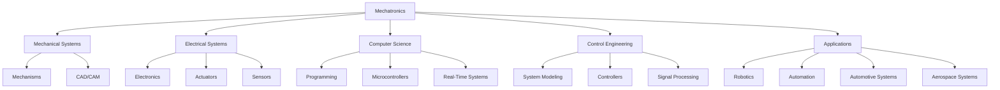

```mermaid
flowchart TD
    Mechatronics --> Mechanical[Mechanical Systems]
    Mechatronics --> Electrical[Electrical Systems]
    Mechatronics --> CS[Computer Science]
    Mechatronics --> Control[Control Engineering]

    Mechanical --> Mechanisms[Mechanisms]
    Mechanical --> CAD[CAD/CAM]

    Electrical --> Electronics[Electronics]
    Electrical --> Actuators[Actuators]
    Electrical --> Sensors[Sensors]

    CS --> Programming[Programming]
    CS --> Microcontrollers[Microcontrollers]
    CS --> RealTime[Real-Time Systems]

    Control --> Modeling[System Modeling]
    Control --> Controllers[Controllers]
    Control --> SignalProcessing[Signal Processing]

    Mechatronics --> Applications[Applications]
    Applications --> Robotics[Robotics]
    Applications --> Automation[Automation]
    Applications --> Automotive[Automotive Systems]
    Applications --> Aerospace[Aerospace Systems]
```
