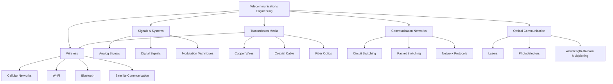

```mermaid
flowchart TD
    TE[Telecommunications Engineering] --> Signals[Signals & Systems]
    TE --> Transmission[Transmission Media]
    TE --> Networks[Communication Networks]
    TE --> Wireless[Wireless Communication]
    TE --> Optical[Optical Communication]

    Signals --> Analog[Analog Signals]
    Signals --> Digital[Digital Signals]
    Signals --> Modulation[Modulation Techniques]

    Transmission --> Copper[Copper Wires]
    Transmission --> Coaxial[Coaxial Cable]
    Transmission --> Fiber[Fiber Optics]
    Transmission --> Wireless[Wireless]

    Networks --> Circuit[Circuit Switching]
    Networks --> Packet[Packet Switching]
    Networks --> Protocols[Network Protocols]

    Wireless --> Cellular[Cellular Networks]
    Wireless --> WiFi[Wi-Fi]
    Wireless --> Bluetooth[Bluetooth]
    Wireless --> Satellite[Satellite Communication]

    Optical --> Lasers[Lasers]
    Optical --> Photodetectors[Photodetectors]
    Optical --> WDM[Wavelength-Division Multiplexing]
```
