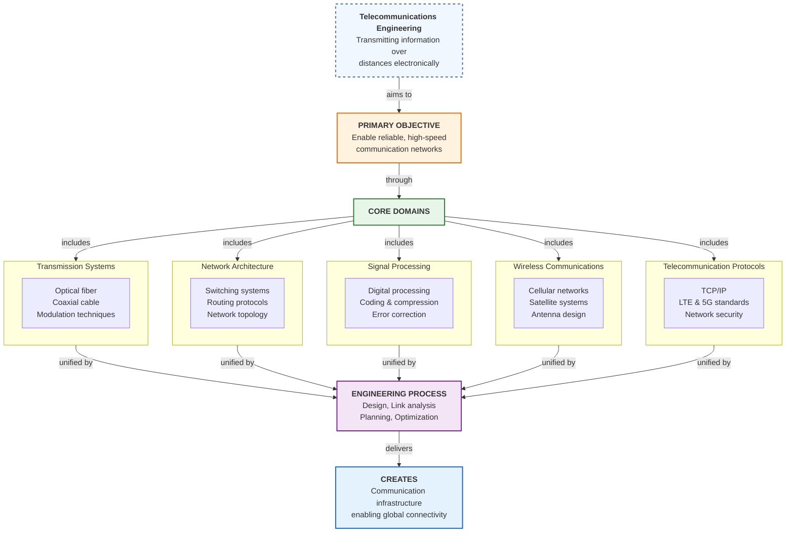

```mermaid
flowchart TD
    A[<b>Telecommunications Engineering</b><br>Transmitting information over<br>distances electronically]:::title
    B[<b>PRIMARY OBJECTIVE</b><br>Enable reliable, high-speed<br>communication networks]:::objective
    C[<b>CORE DOMAINS</b>]:::domains
    
    subgraph D[Transmission Systems]
        D1[Optical fiber<br>Coaxial cable<br>Modulation techniques]
    end
    
    subgraph E[Network Architecture]
        E1[Switching systems<br>Routing protocols<br>Network topology]
    end
    
    subgraph F[Signal Processing]
        F1[Digital processing<br>Coding & compression<br>Error correction]
    end
    
    subgraph G[Wireless Communications]
        G1[Cellular networks<br>Satellite systems<br>Antenna design]
    end
    
    subgraph H[Telecommunication Protocols]
        H1[TCP/IP<br>LTE & 5G standards<br>Network security]
    end
    
    I[<b>ENGINEERING PROCESS</b><br>Design, Link analysis<br>Planning, Optimization]:::process
    
    J[<b>CREATES</b><br>Communication infrastructure<br>enabling global connectivity]:::outcome
    
    A -->|aims to| B
    B -->|through| C
    C -->|includes| D
    C -->|includes| E
    C -->|includes| F
    C -->|includes| G
    C -->|includes| H
    D & E & F & G & H -->|unified by| I
    I -->|delivers| J
    
    classDef title fill:#f0f7ff,stroke:#4a6fa5,stroke-width:2px,color:#333,stroke-dasharray: 5 5
    classDef objective fill:#fff3e0,stroke:#ef6c00,stroke-width:2px,color:#333
    classDef domains fill:#e8f5e9,stroke:#2e7d32,stroke-width:2px,color:#333
    classDef process fill:#f3e5f5,stroke:#7b1fa2,stroke-width:2px,color:#333
    classDef outcome fill:#e3f2fd,stroke:#1565c0,stroke-width:2px,color:#333
```
