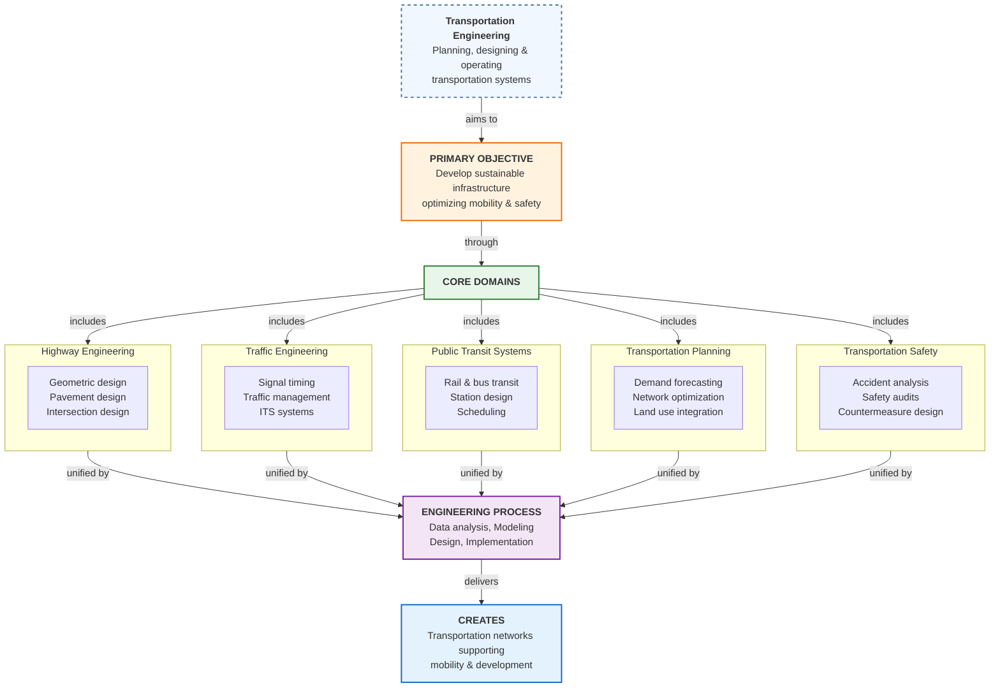

```mermaid
flowchart TD
    A[<b>Transportation Engineering</b><br>Planning, designing & operating<br>transportation systems]:::title
    B[<b>PRIMARY OBJECTIVE</b><br>Develop sustainable infrastructure<br>optimizing mobility & safety]:::objective
    C[<b>CORE DOMAINS</b>]:::domains
    
    subgraph D[Highway Engineering]
        D1[Geometric design<br>Pavement design<br>Intersection design]
    end
    
    subgraph E[Traffic Engineering]
        E1[Signal timing<br>Traffic management<br>ITS systems]
    end
    
    subgraph F[Public Transit Systems]
        F1[Rail & bus transit<br>Station design<br>Scheduling]
    end
    
    subgraph G[Transportation Planning]
        G1[Demand forecasting<br>Network optimization<br>Land use integration]
    end
    
    subgraph H[Transportation Safety]
        H1[Accident analysis<br>Safety audits<br>Countermeasure design]
    end
    
    I[<b>ENGINEERING PROCESS</b><br>Data analysis, Modeling<br>Design, Implementation]:::process
    
    J[<b>CREATES</b><br>Transportation networks supporting<br>mobility & development]:::outcome
    
    A -->|aims to| B
    B -->|through| C
    C -->|includes| D
    C -->|includes| E
    C -->|includes| F
    C -->|includes| G
    C -->|includes| H
    D & E & F & G & H -->|unified by| I
    I -->|delivers| J
    
    classDef title fill:#f0f7ff,stroke:#4a6fa5,stroke-width:2px,color:#333,stroke-dasharray: 5 5
    classDef objective fill:#fff3e0,stroke:#ef6c00,stroke-width:2px,color:#333
    classDef domains fill:#e8f5e9,stroke:#2e7d32,stroke-width:2px,color:#333
    classDef process fill:#f3e5f5,stroke:#7b1fa2,stroke-width:2px,color:#333
    classDef outcome fill:#e3f2fd,stroke:#1565c0,stroke-width:2px,color:#333
```
