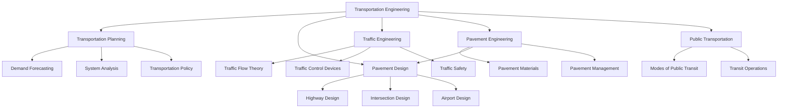

```mermaid
flowchart TD
    TransE[Transportation Engineering] --> Planning[Transportation Planning]
    TransE --> Design[Geometric Design]
    TransE --> Traffic[Traffic Engineering]
    TransE --> Pavement[Pavement Engineering]
    TransE --> Public[Public Transportation]

    Planning --> Demand[Demand Forecasting]
    Planning --> System[System Analysis]
    Planning --> Policy[Transportation Policy]

    Design --> Highways[Highway Design]
    Design --> Intersections[Intersection Design]
    Design --> Airports[Airport Design]

    Traffic --> Flow[Traffic Flow Theory]
    Traffic --> Control[Traffic Control Devices]
    Traffic --> Safety[Traffic Safety]

    Pavement --> Materials[Pavement Materials]
    Pavement --> Design[Pavement Design]
    Pavement --> Management[Pavement Management]

    Public --> Modes[Modes of Public Transit]
    Public --> Operations[Transit Operations]
```
