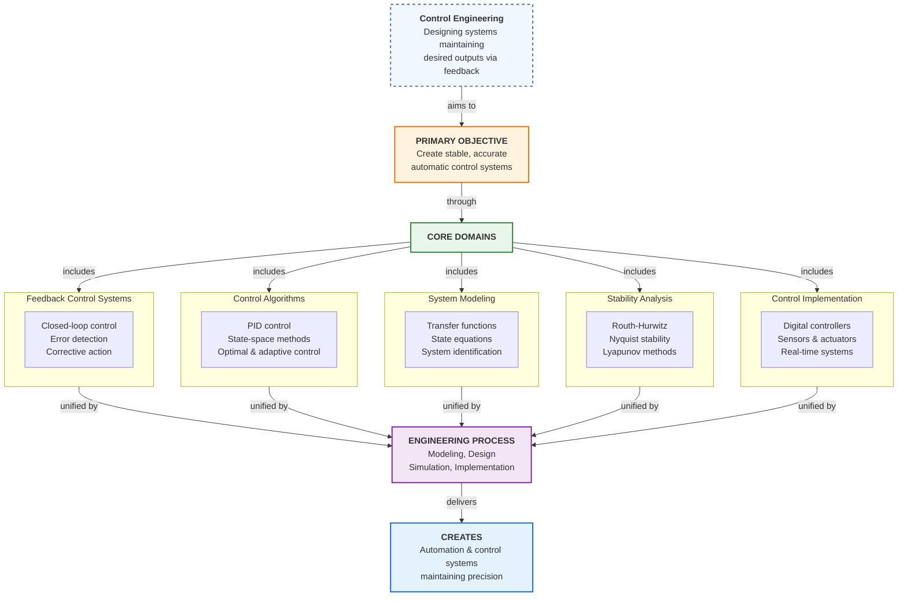

```mermaid
flowchart TD
    A[<b>Control Engineering</b><br>Designing systems maintaining<br>desired outputs via feedback]:::title
    B[<b>PRIMARY OBJECTIVE</b><br>Create stable, accurate<br>automatic control systems]:::objective
    C[<b>CORE DOMAINS</b>]:::domains
    
    subgraph D[Feedback Control Systems]
        D1[Closed-loop control<br>Error detection<br>Corrective action]
    end
    
    subgraph E[Control Algorithms]
        E1[PID control<br>State-space methods<br>Optimal & adaptive control]
    end
    
    subgraph F[System Modeling]
        F1[Transfer functions<br>State equations<br>System identification]
    end
    
    subgraph G[Stability Analysis]
        G1[Routh-Hurwitz<br>Nyquist stability<br>Lyapunov methods]
    end
    
    subgraph H[Control Implementation]
        H1[Digital controllers<br>Sensors & actuators<br>Real-time systems]
    end
    
    I[<b>ENGINEERING PROCESS</b><br>Modeling, Design<br>Simulation, Implementation]:::process
    
    J[<b>CREATES</b><br>Automation & control systems<br>maintaining precision]:::outcome
    
    A -->|aims to| B
    B -->|through| C
    C -->|includes| D
    C -->|includes| E
    C -->|includes| F
    C -->|includes| G
    C -->|includes| H
    D & E & F & G & H -->|unified by| I
    I -->|delivers| J
    
    classDef title fill:#f0f7ff,stroke:#4a6fa5,stroke-width:2px,color:#333,stroke-dasharray: 5 5
    classDef objective fill:#fff3e0,stroke:#ef6c00,stroke-width:2px,color:#333
    classDef domains fill:#e8f5e9,stroke:#2e7d32,stroke-width:2px,color:#333
    classDef process fill:#f3e5f5,stroke:#7b1fa2,stroke-width:2px,color:#333
    classDef outcome fill:#e3f2fd,stroke:#1565c0,stroke-width:2px,color:#333
```
