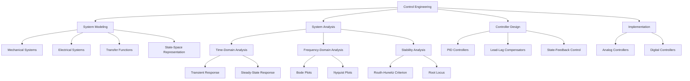

```mermaid
flowchart TD
    CE[Control Engineering] --> Modeling[System Modeling]
    CE --> Analysis[System Analysis]
    CE --> Design[Controller Design]
    CE --> Implementation[Implementation]

    Modeling --> Mechanical[Mechanical Systems]
    Modeling --> Electrical[Electrical Systems]
    Modeling --> TransferFunctions[Transfer Functions]
    Modeling --> StateSpace[State-Space Representation]

    Analysis --> Time[Time-Domain Analysis]
    Analysis --> Frequency[Frequency-Domain Analysis]
    Analysis --> Stability[Stability Analysis]

    Time --> Transient[Transient Response]
    Time --> SteadyState[Steady-State Response]

    Frequency --> Bode[Bode Plots]
    Frequency --> Nyquist[Nyquist Plots]

    Stability --> RouthHurwitz[Routh-Hurwitz Criterion]
    Stability --> RootLocus[Root Locus]

    Design --> PID[PID Controllers]
    Design --> LeadLag[Lead-Lag Compensators]
    Design --> StateFeedback[State-Feedback Control]

    Implementation --> Analog[Analog Controllers]
    Implementation --> Digital[Digital Controllers]
```
