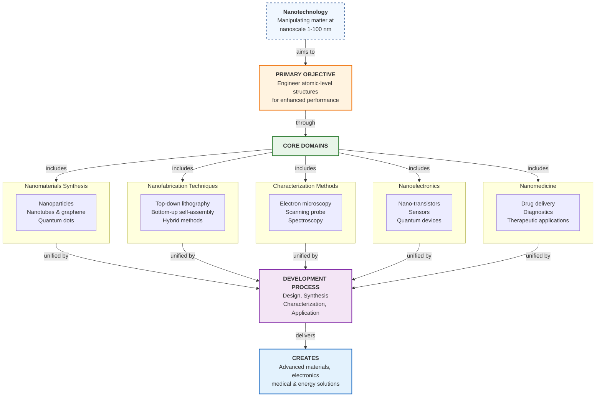

```mermaid
flowchart TD
    A[<b>Nanotechnology</b><br>Manipulating matter at<br>nanoscale 1-100 nm]:::title
    B[<b>PRIMARY OBJECTIVE</b><br>Engineer atomic-level structures<br>for enhanced performance]:::objective
    C[<b>CORE DOMAINS</b>]:::domains
    
    subgraph D[Nanomaterials Synthesis]
        D1[Nanoparticles<br>Nanotubes & graphene<br>Quantum dots]
    end
    
    subgraph E[Nanofabrication Techniques]
        E1[Top-down lithography<br>Bottom-up self-assembly<br>Hybrid methods]
    end
    
    subgraph F[Characterization Methods]
        F1[Electron microscopy<br>Scanning probe<br>Spectroscopy]
    end
    
    subgraph G[Nanoelectronics]
        G1[Nano-transistors<br>Sensors<br>Quantum devices]
    end
    
    subgraph H[Nanomedicine]
        H1[Drug delivery<br>Diagnostics<br>Therapeutic applications]
    end
    
    I[<b>DEVELOPMENT PROCESS</b><br>Design, Synthesis<br>Characterization, Application]:::process
    
    J[<b>CREATES</b><br>Advanced materials, electronics<br>medical & energy solutions]:::outcome
    
    A -->|aims to| B
    B -->|through| C
    C -->|includes| D
    C -->|includes| E
    C -->|includes| F
    C -->|includes| G
    C -->|includes| H
    D & E & F & G & H -->|unified by| I
    I -->|delivers| J
    
    classDef title fill:#f0f7ff,stroke:#4a6fa5,stroke-width:2px,color:#333,stroke-dasharray: 5 5
    classDef objective fill:#fff3e0,stroke:#ef6c00,stroke-width:2px,color:#333
    classDef domains fill:#e8f5e9,stroke:#2e7d32,stroke-width:2px,color:#333
    classDef process fill:#f3e5f5,stroke:#7b1fa2,stroke-width:2px,color:#333
    classDef outcome fill:#e3f2fd,stroke:#1565c0,stroke-width:2px,color:#333
```
