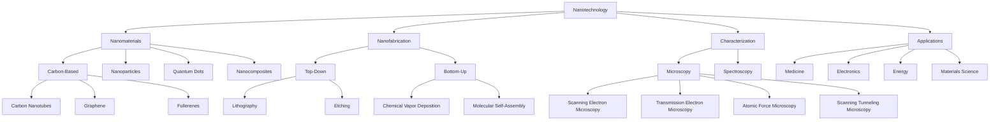

```mermaid
flowchart TD
    Nano[Nanotechnology] --> Nanomaterials[Nanomaterials]
    Nano --> Fabrication[Nanofabrication]
    Nano --> Characterization[Characterization]
    Nano --> Applications[Applications]

    Nanomaterials --> Carbon[Carbon-Based]
    Nanomaterials --> Nanoparticles[Nanoparticles]
    Nanomaterials --> QuantumDots[Quantum Dots]
    Nanomaterials --> Nanocomposites[Nanocomposites]

    Carbon --> CNTs[Carbon Nanotubes]
    Carbon --> Graphene[Graphene]
    Carbon --> Fullerenes[Fullerenes]

    Fabrication --> TopDown[Top-Down]
    Fabrication --> BottomUp[Bottom-Up]

    TopDown --> Lithography[Lithography]
    TopDown --> Etching[Etching]

    BottomUp --> CVD[Chemical Vapor Deposition]
    BottomUp --> SelfAssembly[Molecular Self-Assembly]

    Characterization --> Microscopy[Microscopy]
    Characterization --> Spectroscopy[Spectroscopy]

    Microscopy --> SEM[Scanning Electron Microscopy]
    Microscopy --> TEM[Transmission Electron Microscopy]
    Microscopy --> AFM[Atomic Force Microscopy]
    Microscopy --> STM[Scanning Tunneling Microscopy]

    Applications --> Medicine[Medicine]
    Applications --> Electronics[Electronics]
    Applications --> Energy[Energy]
    Applications --> Materials[Materials Science]
```
