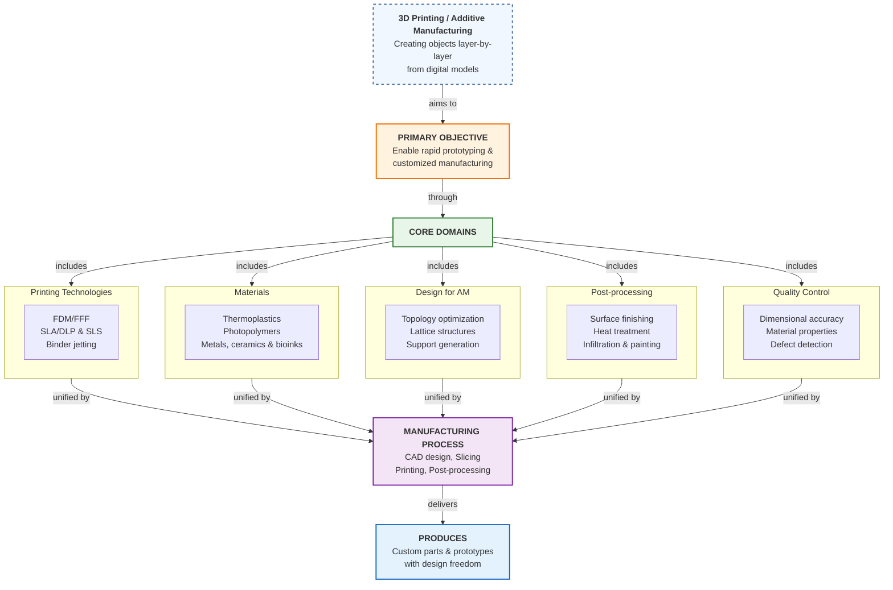

```mermaid
flowchart TD
    A[<b>3D Printing / Additive Manufacturing</b><br>Creating objects layer-by-layer<br>from digital models]:::title
    B[<b>PRIMARY OBJECTIVE</b><br>Enable rapid prototyping &<br>customized manufacturing]:::objective
    C[<b>CORE DOMAINS</b>]:::domains
    
    subgraph D[Printing Technologies]
        D1[FDM/FFF<br>SLA/DLP & SLS<br>Binder jetting]
    end
    
    subgraph E[Materials]
        E1[Thermoplastics<br>Photopolymers<br>Metals, ceramics & bioinks]
    end
    
    subgraph F[Design for AM]
        F1[Topology optimization<br>Lattice structures<br>Support generation]
    end
    
    subgraph G[Post-processing]
        G1[Surface finishing<br>Heat treatment<br>Infiltration & painting]
    end
    
    subgraph H[Quality Control]
        H1[Dimensional accuracy<br>Material properties<br>Defect detection]
    end
    
    I[<b>MANUFACTURING PROCESS</b><br>CAD design, Slicing<br>Printing, Post-processing]:::process
    
    J[<b>PRODUCES</b><br>Custom parts & prototypes<br>with design freedom]:::outcome
    
    A -->|aims to| B
    B -->|through| C
    C -->|includes| D
    C -->|includes| E
    C -->|includes| F
    C -->|includes| G
    C -->|includes| H
    D & E & F & G & H -->|unified by| I
    I -->|delivers| J
    
    classDef title fill:#f0f7ff,stroke:#4a6fa5,stroke-width:2px,color:#333,stroke-dasharray: 5 5
    classDef objective fill:#fff3e0,stroke:#ef6c00,stroke-width:2px,color:#333
    classDef domains fill:#e8f5e9,stroke:#2e7d32,stroke-width:2px,color:#333
    classDef process fill:#f3e5f5,stroke:#7b1fa2,stroke-width:2px,color:#333
    classDef outcome fill:#e3f2fd,stroke:#1565c0,stroke-width:2px,color:#333
```
