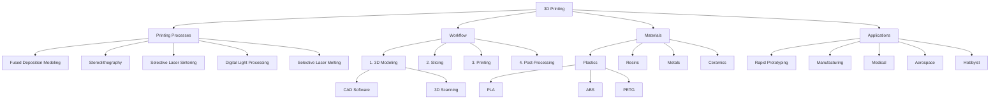

```mermaid
flowchart TD
    3DP[3D Printing] --> Processes[Printing Processes]
    3DP --> Workflow[Workflow]
    3DP --> Materials[Materials]
    3DP --> Applications[Applications]

    Processes --> FDM[Fused Deposition Modeling]
    Processes --> SLA[Stereolithography]
    Processes --> SLS[Selective Laser Sintering]
    Processes --> DLP[Digital Light Processing]
    Processes --> SLM[Selective Laser Melting]

    Workflow --> Modeling[1. 3D Modeling]
    Workflow --> Slicing[2. Slicing]
    Workflow --> Printing[3. Printing]
    Workflow --> PostProcessing[4. Post-Processing]

    Modeling --> CAD[CAD Software]
    Modeling --> Scanning[3D Scanning]

    Materials --> Plastics[Plastics]
    Materials --> Resins[Resins]
    Materials --> Metals[Metals]
    Materials --> Ceramics[Ceramics]

    Plastics --> PLA[PLA]
    Plastics --> ABS[ABS]
    Plastics --> PETG[PETG]

    Applications --> Prototyping[Rapid Prototyping]
    Applications --> Manufacturing[Manufacturing]
    Applications --> Medical[Medical]
    Applications --> Aerospace[Aerospace]
    Applications --> Hobbyist[Hobbyist]
```
