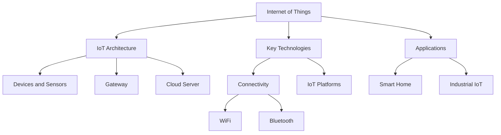

```mermaid
flowchart TD
    InternetofThings[Internet of Things] --> Architecture[IoT Architecture]
    InternetofThings --> Technologies[Key Technologies]
    InternetofThings --> Applications[Applications]
    Architecture --> Devices[Devices and Sensors]
    Architecture --> Gateway[Gateway]
    Architecture --> Cloud[Cloud Server]
    Technologies --> Connectivity[Connectivity]
    Technologies --> Platforms[IoT Platforms]
    Connectivity --> WiFi[WiFi]
    Connectivity --> Bluetooth[Bluetooth]
    Applications --> SmartHome[Smart Home]
    Applications --> Industrial[Industrial IoT]
```