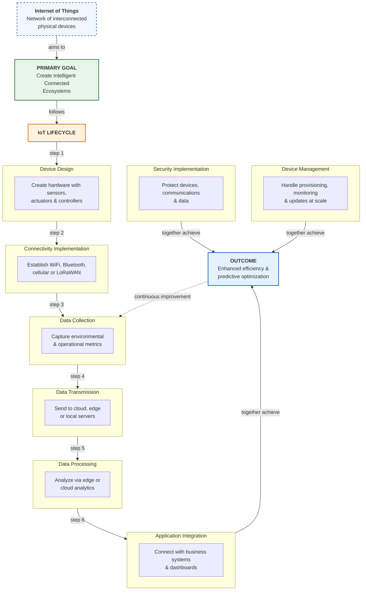

```mermaid
flowchart TD
    A[<b>Internet of Things</b><br>Network of interconnected<br>physical devices]:::title
    B[<b>PRIMARY GOAL</b><br>Create Intelligent Connected<br>Ecosystems]:::goal
    C[<b>IoT LIFECYCLE</b>]:::process
    
    subgraph D[Device Design]
        D1[Create hardware with sensors,<br>actuators & controllers]
    end
    
    subgraph E[Connectivity Implementation]
        E1[Establish WiFi, Bluetooth,<br>cellular or LoRaWAN]
    end
    
    subgraph F[Data Collection]
        F1[Capture environmental<br>& operational metrics]
    end
    
    subgraph G[Data Transmission]
        G1[Send to cloud, edge<br>or local servers]
    end
    
    subgraph H[Data Processing]
        H1[Analyze via edge or<br>cloud analytics]
    end
    
    subgraph I[Application Integration]
        I1[Connect with business systems<br>& dashboards]
    end
    
    subgraph J[Security Implementation]
        J1[Protect devices, communications<br>& data]
    end
    
    subgraph K[Device Management]
        K1[Handle provisioning, monitoring<br>& updates at scale]
    end
    
    L[<b>OUTCOME</b><br>Enhanced efficiency &<br>predictive optimization]:::outcome
    
    A -->|aims to| B
    B -->|follows| C
    C -->|step 1| D
    D -->|step 2| E
    E -->|step 3| F
    F -->|step 4| G
    G -->|step 5| H
    H -->|step 6| I
    I & J & K -->|together achieve| L
    L -.->|continuous improvement| F
    
    classDef title fill:#f0f7ff,stroke:#4a6fa5,stroke-width:2px,color:#333,stroke-dasharray:5 5
    classDef goal fill:#e8f5e9,stroke:#2e7d32,stroke-width:2px,color:#333
    classDef process fill:#fff3e0,stroke:#ef6c00,stroke-width:2px,color:#333
    classDef outcome fill:#e3f2fd,stroke:#1565c0,stroke-width:2px,color:#333
```