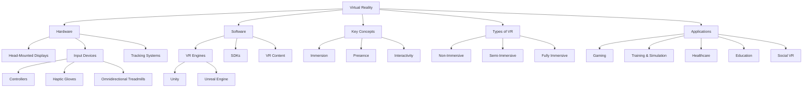

```mermaid
flowchart TD
    VR[Virtual Reality] --> Hardware[Hardware]
    VR --> Software[Software]
    VR --> Concepts[Key Concepts]
    VR --> Types[Types of VR]
    VR --> Applications[Applications]

    Hardware --> HMDs[Head-Mounted Displays]
    Hardware --> Input[Input Devices]
    Hardware --> Tracking[Tracking Systems]

    Input --> Controllers[Controllers]
    Input --> Gloves[Haptic Gloves]
    Input --> Treadmills[Omnidirectional Treadmills]

    Software --> Engines[VR Engines]
    Software --> SDKs[SDKs]
    Software --> Content[VR Content]

    Engines --> Unity[Unity]
    Engines --> Unreal[Unreal Engine]

    Concepts --> Immersion[Immersion]
    Concepts --> Presence[Presence]
    Concepts --> Interactivity[Interactivity]

    Types --> NonImmersive[Non-Immersive]
    Types --> SemiImmersive[Semi-Immersive]
    Types --> FullyImmersive[Fully Immersive]

    Applications --> Gaming[Gaming]
    Applications --> Training[Training & Simulation]
    Applications --> Healthcare[Healthcare]
    Applications --> Education[Education]
    Applications --> Social[Social VR]
```
