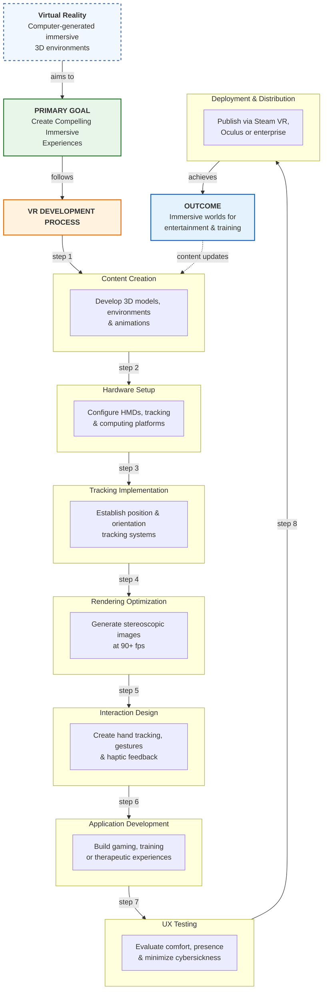

```mermaid
flowchart TD
    A[<b>Virtual Reality</b><br>Computer-generated immersive<br>3D environments]:::title
    B[<b>PRIMARY GOAL</b><br>Create Compelling Immersive<br>Experiences]:::goal
    C[<b>VR DEVELOPMENT PROCESS</b>]:::process
    
    subgraph D[Content Creation]
        D1[Develop 3D models, environments<br>& animations]
    end
    
    subgraph E[Hardware Setup]
        E1[Configure HMDs, tracking<br>& computing platforms]
    end
    
    subgraph F[Tracking Implementation]
        F1[Establish position & orientation<br>tracking systems]
    end
    
    subgraph G[Rendering Optimization]
        G1[Generate stereoscopic images<br>at 90+ fps]
    end
    
    subgraph H[Interaction Design]
        H1[Create hand tracking, gestures<br>& haptic feedback]
    end
    
    subgraph I[Application Development]
        I1[Build gaming, training<br>or therapeutic experiences]
    end
    
    subgraph J[UX Testing]
        J1[Evaluate comfort, presence<br>& minimize cybersickness]
    end
    
    subgraph K[Deployment & Distribution]
        K1[Publish via Steam VR,<br>Oculus or enterprise]
    end
    
    L[<b>OUTCOME</b><br>Immersive worlds for<br>entertainment & training]:::outcome
    
    A -->|aims to| B
    B -->|follows| C
    C -->|step 1| D
    D -->|step 2| E
    E -->|step 3| F
    F -->|step 4| G
    G -->|step 5| H
    H -->|step 6| I
    I -->|step 7| J
    J -->|step 8| K
    K -->|achieves| L
    L -.->|content updates| D
    
    classDef title fill:#f0f7ff,stroke:#4a6fa5,stroke-width:2px,color:#333,stroke-dasharray:5 5
    classDef goal fill:#e8f5e9,stroke:#2e7d32,stroke-width:2px,color:#333
    classDef process fill:#fff3e0,stroke:#ef6c00,stroke-width:2px,color:#333
    classDef outcome fill:#e3f2fd,stroke:#1565c0,stroke-width:2px,color:#333
```
