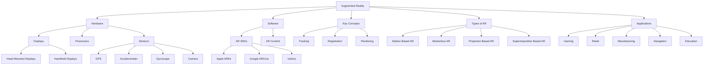

```mermaid
flowchart TD
    AR[Augmented Reality] --> Hardware[Hardware]
    AR --> Software[Software]
    AR --> Concepts[Key Concepts]
    AR --> Types[Types of AR]
    AR --> Applications[Applications]

    Hardware --> Displays[Displays]
    Hardware --> Processors[Processors]
    Hardware --> Sensors[Sensors]

    Displays --> HMDs[Head-Mounted Displays]
    Displays --> Handheld[Handheld Displays]

    Sensors --> GPS[GPS]
    Sensors --> Accelerometer[Accelerometer]
    Sensors --> Gyroscope[Gyroscope]
    Sensors --> Camera[Camera]

    Software --> SDKs[AR SDKs]
    Software --> Content[AR Content]

    SDKs --> ARKit[Apple ARKit]
    SDKs --> ARCore[Google ARCore]
    SDKs --> Vuforia[Vuforia]

    Concepts --> Tracking[Tracking]
    Concepts --> Registration[Registration]
    Concepts --> Rendering[Rendering]

    Types --> MarkerBased[Marker-Based AR]
    Types --> Markerless[Markerless AR]
    Types --> ProjectionBased[Projection-Based AR]
    Types --> Superimposition[Superimposition-Based AR]

    Applications --> Gaming[Gaming]
    Applications --> Retail[Retail]
    Applications --> Manufacturing[Manufacturing]
    Applications --> Navigation[Navigation]
    Applications --> Education[Education]
```
