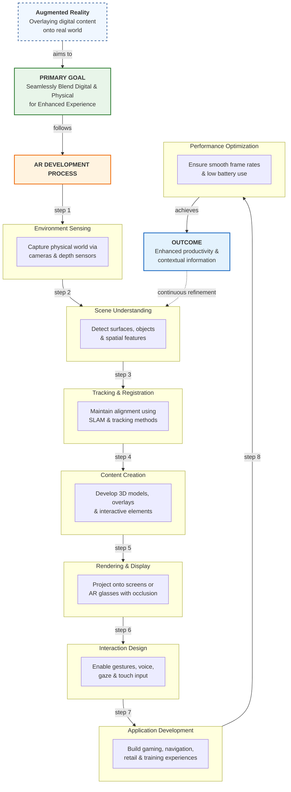

```mermaid
flowchart TD
    A[<b>Augmented Reality</b><br>Overlaying digital content<br>onto real world]:::title
    B[<b>PRIMARY GOAL</b><br>Seamlessly Blend Digital & Physical<br>for Enhanced Experience]:::goal
    C[<b>AR DEVELOPMENT PROCESS</b>]:::process
    
    subgraph D[Environment Sensing]
        D1[Capture physical world via<br>cameras & depth sensors]
    end
    
    subgraph E[Scene Understanding]
        E1[Detect surfaces, objects<br>& spatial features]
    end
    
    subgraph F[Tracking & Registration]
        F1[Maintain alignment using<br>SLAM & tracking methods]
    end
    
    subgraph G[Content Creation]
        G1[Develop 3D models, overlays<br>& interactive elements]
    end
    
    subgraph H[Rendering & Display]
        H1[Project onto screens or<br>AR glasses with occlusion]
    end
    
    subgraph I[Interaction Design]
        I1[Enable gestures, voice,<br>gaze & touch input]
    end
    
    subgraph J[Application Development]
        J1[Build gaming, navigation,<br>retail & training experiences]
    end
    
    subgraph K[Performance Optimization]
        K1[Ensure smooth frame rates<br>& low battery use]
    end
    
    L[<b>OUTCOME</b><br>Enhanced productivity &<br>contextual information]:::outcome
    
    A -->|aims to| B
    B -->|follows| C
    C -->|step 1| D
    D -->|step 2| E
    E -->|step 3| F
    F -->|step 4| G
    G -->|step 5| H
    H -->|step 6| I
    I -->|step 7| J
    J -->|step 8| K
    K -->|achieves| L
    L -.->|continuous refinement| E
    
    classDef title fill:#f0f7ff,stroke:#4a6fa5,stroke-width:2px,color:#333,stroke-dasharray:5 5
    classDef goal fill:#e8f5e9,stroke:#2e7d32,stroke-width:2px,color:#333
    classDef process fill:#fff3e0,stroke:#ef6c00,stroke-width:2px,color:#333
    classDef outcome fill:#e3f2fd,stroke:#1565c0,stroke-width:2px,color:#333
```
