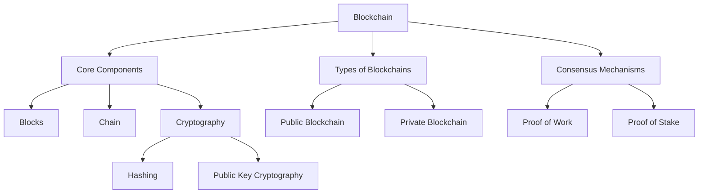

```mermaid
flowchart TD
    Blockchain[Blockchain] --> Core[Core Components]
    Blockchain --> Types[Types of Blockchains]
    Blockchain --> Consensus[Consensus Mechanisms]
    Core --> Blocks[Blocks]
    Core --> Chain[Chain]
    Core --> Cryptography[Cryptography]
    Types --> Public[Public Blockchain]
    Types --> Private[Private Blockchain]
    Consensus --> PoW[Proof of Work]
    Consensus --> PoS[Proof of Stake]
    Cryptography --> Hashing[Hashing]
    Cryptography --> PKI[Public Key Cryptography]
```