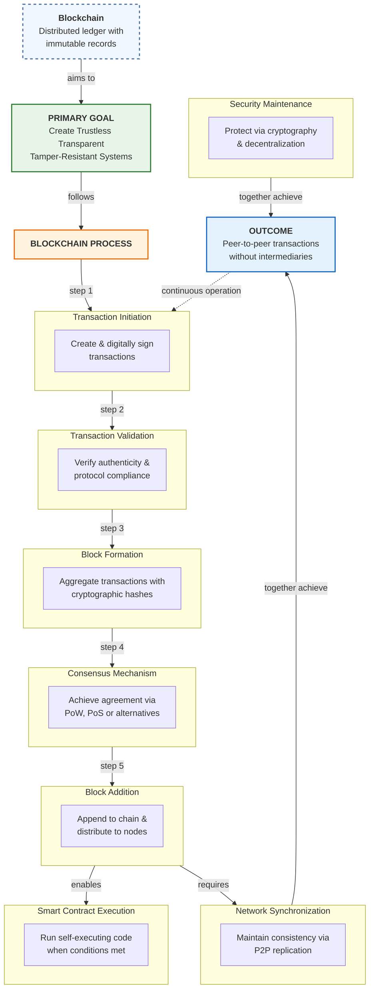

```mermaid
flowchart TD
    A[<b>Blockchain</b><br>Distributed ledger with<br>immutable records]:::title
    B[<b>PRIMARY GOAL</b><br>Create Trustless Transparent<br>Tamper-Resistant Systems]:::goal
    C[<b>BLOCKCHAIN PROCESS</b>]:::process
    
    subgraph D[Transaction Initiation]
        D1[Create & digitally sign<br>transactions]
    end
    
    subgraph E[Transaction Validation]
        E1[Verify authenticity &<br>protocol compliance]
    end
    
    subgraph F[Block Formation]
        F1[Aggregate transactions with<br>cryptographic hashes]
    end
    
    subgraph G[Consensus Mechanism]
        G1[Achieve agreement via<br>PoW, PoS or alternatives]
    end
    
    subgraph H[Block Addition]
        H1[Append to chain &<br>distribute to nodes]
    end
    
    subgraph I[Smart Contract Execution]
        I1[Run self-executing code<br>when conditions met]
    end
    
    subgraph J[Network Synchronization]
        J1[Maintain consistency via<br>P2P replication]
    end
    
    subgraph K[Security Maintenance]
        K1[Protect via cryptography<br>& decentralization]
    end
    
    L[<b>OUTCOME</b><br>Peer-to-peer transactions<br>without intermediaries]:::outcome
    
    A -->|aims to| B
    B -->|follows| C
    C -->|step 1| D
    D -->|step 2| E
    E -->|step 3| F
    F -->|step 4| G
    G -->|step 5| H
    H -->|enables| I
    H -->|requires| J
    J & K -->|together achieve| L
    L -.->|continuous operation| D
    
    classDef title fill:#f0f7ff,stroke:#4a6fa5,stroke-width:2px,color:#333,stroke-dasharray:5 5
    classDef goal fill:#e8f5e9,stroke:#2e7d32,stroke-width:2px,color:#333
    classDef process fill:#fff3e0,stroke:#ef6c00,stroke-width:2px,color:#333
    classDef outcome fill:#e3f2fd,stroke:#1565c0,stroke-width:2px,color:#333
```