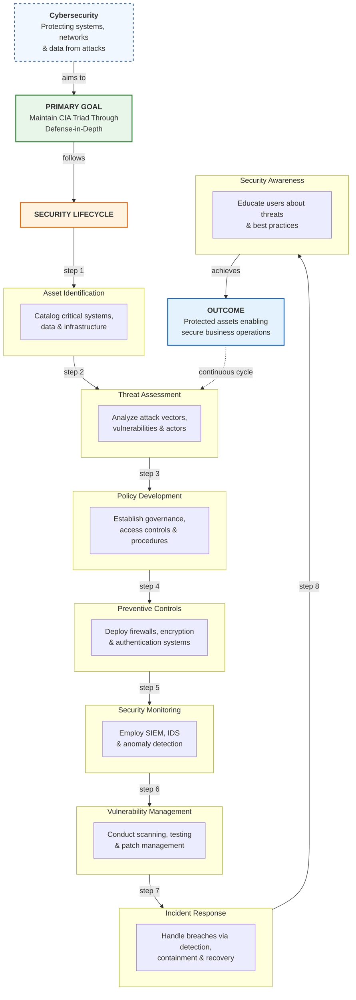

```mermaid
flowchart TD
    A[<b>Cybersecurity</b><br>Protecting systems, networks<br>& data from attacks]:::title
    B[<b>PRIMARY GOAL</b><br>Maintain CIA Triad Through<br>Defense-in-Depth]:::goal
    C[<b>SECURITY LIFECYCLE</b>]:::process
    
    subgraph D[Asset Identification]
        D1[Catalog critical systems,<br>data & infrastructure]
    end
    
    subgraph E[Threat Assessment]
        E1[Analyze attack vectors,<br>vulnerabilities & actors]
    end
    
    subgraph F[Policy Development]
        F1[Establish governance,<br>access controls & procedures]
    end
    
    subgraph G[Preventive Controls]
        G1[Deploy firewalls, encryption<br>& authentication systems]
    end
    
    subgraph H[Security Monitoring]
        H1[Employ SIEM, IDS<br>& anomaly detection]
    end
    
    subgraph I[Vulnerability Management]
        I1[Conduct scanning, testing<br>& patch management]
    end
    
    subgraph J[Incident Response]
        J1[Handle breaches via detection,<br>containment & recovery]
    end
    
    subgraph K[Security Awareness]
        K1[Educate users about threats<br>& best practices]
    end
    
    L[<b>OUTCOME</b><br>Protected assets enabling<br>secure business operations]:::outcome
    
    A -->|aims to| B
    B -->|follows| C
    C -->|step 1| D
    D -->|step 2| E
    E -->|step 3| F
    F -->|step 4| G
    G -->|step 5| H
    H -->|step 6| I
    I -->|step 7| J
    J -->|step 8| K
    K -->|achieves| L
    L -.->|continuous cycle| E
    
    classDef title fill:#f0f7ff,stroke:#4a6fa5,stroke-width:2px,color:#333,stroke-dasharray:5 5
    classDef goal fill:#e8f5e9,stroke:#2e7d32,stroke-width:2px,color:#333
    classDef process fill:#fff3e0,stroke:#ef6c00,stroke-width:2px,color:#333
    classDef outcome fill:#e3f2fd,stroke:#1565c0,stroke-width:2px,color:#333
```
