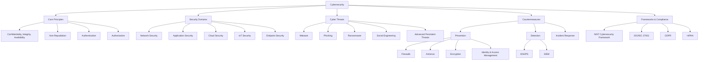

```mermaid
flowchart TD
    Cybersecurity --> Principles[Core Principles]
    Cybersecurity --> Domains[Security Domains]
    Cybersecurity --> Threats[Cyber Threats]
    Cybersecurity --> Countermeasures[Countermeasures]
    Cybersecurity --> Frameworks[Frameworks & Compliance]

    Principles --> CIA[Confidentiality, Integrity, Availability]
    Principles --> NonRepudiation[Non-Repudiation]
    Principles --> Authentication[Authentication]
    Principles --> Authorization[Authorization]

    Domains --> Network[Network Security]
    Domains --> App[Application Security]
    Domains --> Cloud[Cloud Security]
    Domains --> IoT[IoT Security]
    Domains --> Endpoint[Endpoint Security]

    Threats --> Malware[Malware]
    Threats --> Phishing[Phishing]
    Threats --> Ransomware[Ransomware]
    Threats --> SocialEng[Social Engineering]
    Threats --> APTs[Advanced Persistent Threats]

    Countermeasures --> Prevention[Prevention]
    Countermeasures --> Detection[Detection]
    Countermeasures --> Response[Incident Response]

    Prevention --> Firewalls[Firewalls]
    Prevention --> AV[Antivirus]
    Prevention --> Encryption[Encryption]
    Prevention --> IAM[Identity & Access Management]

    Detection --> IDS_IPS[IDS/IPS]
    Detection --> SIEM[SIEM]

    Frameworks --> NIST[NIST Cybersecurity Framework]
    Frameworks --> ISO27001[ISO/IEC 27001]
    Frameworks --> GDPR[GDPR]
    Frameworks --> HIPAA[HIPAA]
```
