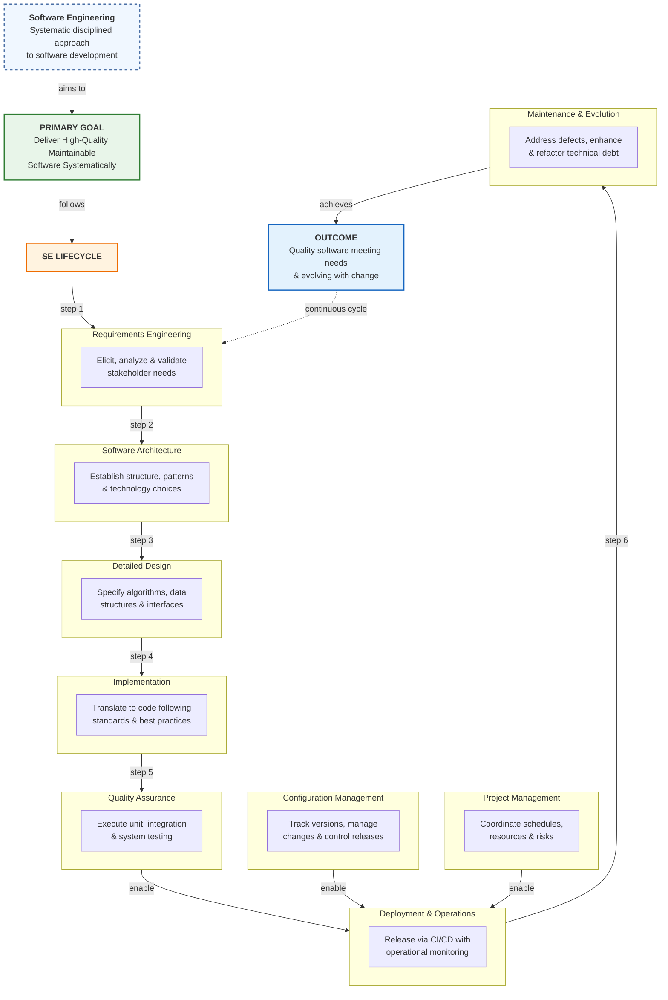

```mermaid
flowchart TD
    A[<b>Software Engineering</b><br>Systematic disciplined approach<br>to software development]:::title
    B[<b>PRIMARY GOAL</b><br>Deliver High-Quality Maintainable<br>Software Systematically]:::goal
    C[<b>SE LIFECYCLE</b>]:::process
    
    subgraph D[Requirements Engineering]
        D1[Elicit, analyze & validate<br>stakeholder needs]
    end
    
    subgraph E[Software Architecture]
        E1[Establish structure, patterns<br>& technology choices]
    end
    
    subgraph F[Detailed Design]
        F1[Specify algorithms, data<br>structures & interfaces]
    end
    
    subgraph G[Implementation]
        G1[Translate to code following<br>standards & best practices]
    end
    
    subgraph H[Quality Assurance]
        H1[Execute unit, integration<br>& system testing]
    end
    
    subgraph I[Configuration Management]
        I1[Track versions, manage<br>changes & control releases]
    end
    
    subgraph J[Project Management]
        J1[Coordinate schedules,<br>resources & risks]
    end
    
    subgraph K[Deployment & Operations]
        K1[Release via CI/CD with<br>operational monitoring]
    end
    
    subgraph L[Maintenance & Evolution]
        L1[Address defects, enhance<br>& refactor technical debt]
    end
    
    M[<b>OUTCOME</b><br>Quality software meeting needs<br>& evolving with change]:::outcome
    
    A -->|aims to| B
    B -->|follows| C
    C -->|step 1| D
    D -->|step 2| E
    E -->|step 3| F
    F -->|step 4| G
    G -->|step 5| H
    H & I & J -->|enable| K
    K -->|step 6| L
    L -->|achieves| M
    M -.->|continuous cycle| D
    
    classDef title fill:#f0f7ff,stroke:#4a6fa5,stroke-width:2px,color:#333,stroke-dasharray:5 5
    classDef goal fill:#e8f5e9,stroke:#2e7d32,stroke-width:2px,color:#333
    classDef process fill:#fff3e0,stroke:#ef6c00,stroke-width:2px,color:#333
    classDef outcome fill:#e3f2fd,stroke:#1565c0,stroke-width:2px,color:#333
```
