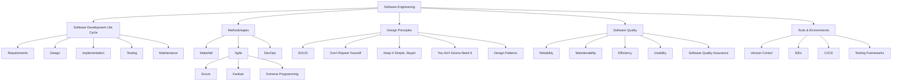

```mermaid
flowchart TD
    SE[Software Engineering] --> SDLC[Software Development Life Cycle]
    SE --> Methodologies[Methodologies]
    SE --> Principles[Design Principles]
    SE --> Quality[Software Quality]
    SE --> Tools[Tools & Environments]

    SDLC --> Requirements[Requirements]
    SDLC --> Design[Design]
    SDLC --> Implementation[Implementation]
    SDLC --> Testing[Testing]
    SDLC --> Maintenance[Maintenance]

    Methodologies --> Waterfall[Waterfall]
    Methodologies --> Agile[Agile]
    Methodologies --> DevOps[DevOps]

    Agile --> Scrum[Scrum]
    Agile --> Kanban[Kanban]
    Agile --> XP[Extreme Programming]

    Principles --> SOLID[SOLID]
    Principles --> DRY[Don't Repeat Yourself]
    Principles --> KISS[Keep It Simple, Stupid]
    Principles --> YAGNI[You Ain't Gonna Need It]
    Principles --> Patterns[Design Patterns]

    Quality --> Reliability[Reliability]
    Quality --> Maintainability[Maintainability]
    Quality --> Efficiency[Efficiency]
    Quality --> Usability[Usability]
    Quality --> SQA[Software Quality Assurance]

    Tools --> VCS[Version Control]
    Tools --> IDEs[IDEs]
    Tools --> CI_CD[CI/CD]
    Tools --> TestingFrameworks[Testing Frameworks]
```
