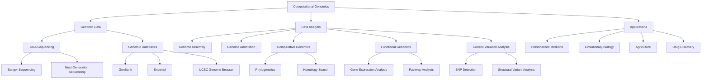

```mermaid
flowchart TD
    CG[Computational Genomics] --> Data[Genomic Data]
    CG --> Analysis[Data Analysis]
    CG --> Applications[Applications]

    Data --> Sequencing[DNA Sequencing]
    Data --> Databases[Genomic Databases]

    Sequencing --> Sanger[Sanger Sequencing]
    Sequencing --> NGS[Next-Generation Sequencing]

    Databases --> GenBank[GenBank]
    Databases --> Ensembl[Ensembl]
    Databases --> UCSC[UCSC Genome Browser]

    Analysis --> Assembly[Genome Assembly]
    Analysis --> Annotation[Genome Annotation]
    Analysis --> Comparison[Comparative Genomics]
    Analysis --> Functional[Functional Genomics]
    Analysis --> Variation[Genetic Variation Analysis]

    Comparison --> Phylogenetics[Phylogenetics]
    Comparison --> Homology[Homology Search]

    Functional --> GeneExpression[Gene Expression Analysis]
    Functional --> Pathway[Pathway Analysis]

    Variation --> SNP[SNP Detection]
    Variation --> SV[Structural Variant Analysis]

    Applications --> Medicine[Personalized Medicine]
    Applications --> Evolution[Evolutionary Biology]
    Applications --> Agriculture[Agriculture]
    Applications --> DrugDiscovery[Drug Discovery]
```
