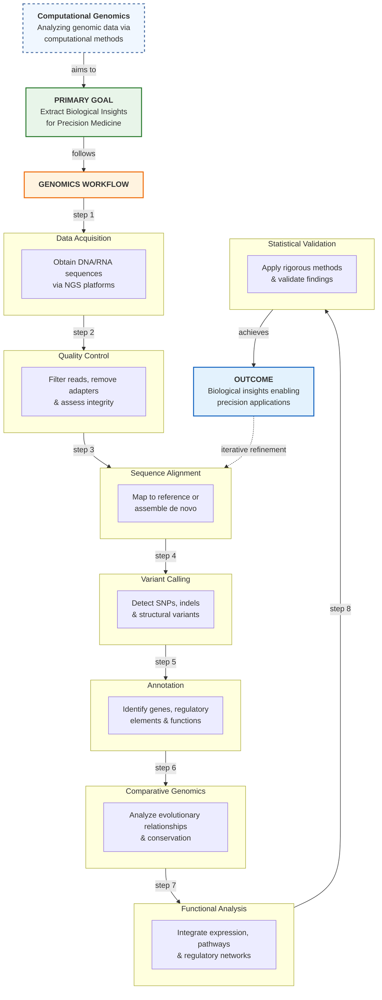

```mermaid
flowchart TD
    A[<b>Computational Genomics</b><br>Analyzing genomic data via<br>computational methods]:::title
    B[<b>PRIMARY GOAL</b><br>Extract Biological Insights<br>for Precision Medicine]:::goal
    C[<b>GENOMICS WORKFLOW</b>]:::process
    
    subgraph D[Data Acquisition]
        D1[Obtain DNA/RNA sequences<br>via NGS platforms]
    end
    
    subgraph E[Quality Control]
        E1[Filter reads, remove adapters<br>& assess integrity]
    end
    
    subgraph F[Sequence Alignment]
        F1[Map to reference or<br>assemble de novo]
    end
    
    subgraph G[Variant Calling]
        G1[Detect SNPs, indels<br>& structural variants]
    end
    
    subgraph H[Annotation]
        H1[Identify genes, regulatory<br>elements & functions]
    end
    
    subgraph I[Comparative Genomics]
        I1[Analyze evolutionary relationships<br>& conservation]
    end
    
    subgraph J[Functional Analysis]
        J1[Integrate expression, pathways<br>& regulatory networks]
    end
    
    subgraph K[Statistical Validation]
        K1[Apply rigorous methods<br>& validate findings]
    end
    
    L[<b>OUTCOME</b><br>Biological insights enabling<br>precision applications]:::outcome
    
    A -->|aims to| B
    B -->|follows| C
    C -->|step 1| D
    D -->|step 2| E
    E -->|step 3| F
    F -->|step 4| G
    G -->|step 5| H
    H -->|step 6| I
    I -->|step 7| J
    J -->|step 8| K
    K -->|achieves| L
    L -.->|iterative refinement| F
    
    classDef title fill:#f0f7ff,stroke:#4a6fa5,stroke-width:2px,color:#333,stroke-dasharray:5 5
    classDef goal fill:#e8f5e9,stroke:#2e7d32,stroke-width:2px,color:#333
    classDef process fill:#fff3e0,stroke:#ef6c00,stroke-width:2px,color:#333
    classDef outcome fill:#e3f2fd,stroke:#1565c0,stroke-width:2px,color:#333
```
