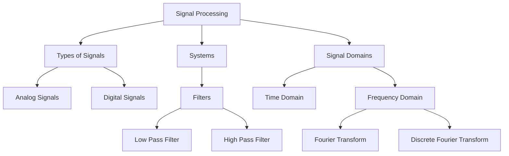

```mermaid
flowchart TD
    SignalProcessing[Signal Processing] --> Signals[Types of Signals]
    SignalProcessing --> Systems[Systems]
    SignalProcessing --> Domains[Signal Domains]
    Signals --> Analog[Analog Signals]
    Signals --> Digital[Digital Signals]
    Systems --> Filters[Filters]
    Filters --> LowPass[Low Pass Filter]
    Filters --> HighPass[High Pass Filter]
    Domains --> Time[Time Domain]
    Domains --> Frequency[Frequency Domain]
    Frequency --> Fourier[Fourier Transform]
    Frequency --> DFT[Discrete Fourier Transform]
```