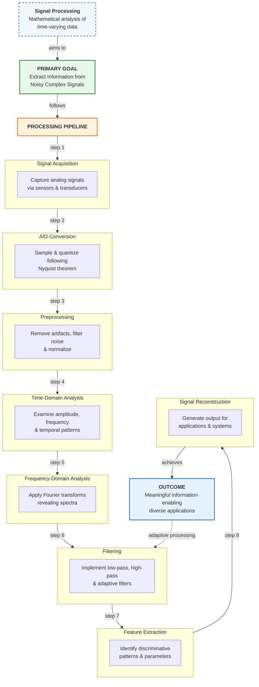

```mermaid
flowchart TD
    A[<b>Signal Processing</b><br>Mathematical analysis of<br>time-varying data]:::title
    B[<b>PRIMARY GOAL</b><br>Extract Information from<br>Noisy Complex Signals]:::goal
    C[<b>PROCESSING PIPELINE</b>]:::process
    
    subgraph D[Signal Acquisition]
        D1[Capture analog signals<br>via sensors & transducers]
    end
    
    subgraph E[A/D Conversion]
        E1[Sample & quantize following<br>Nyquist theorem]
    end
    
    subgraph F[Preprocessing]
        F1[Remove artifacts, filter noise<br>& normalize]
    end
    
    subgraph G[Time-Domain Analysis]
        G1[Examine amplitude, frequency<br>& temporal patterns]
    end
    
    subgraph H[Frequency-Domain Analysis]
        H1[Apply Fourier transforms<br>revealing spectra]
    end
    
    subgraph I[Filtering]
        I1[Implement low-pass, high-pass<br>& adaptive filters]
    end
    
    subgraph J[Feature Extraction]
        J1[Identify discriminative<br>patterns & parameters]
    end
    
    subgraph K[Signal Reconstruction]
        K1[Generate output for<br>applications & systems]
    end
    
    L[<b>OUTCOME</b><br>Meaningful information enabling<br>diverse applications]:::outcome
    
    A -->|aims to| B
    B -->|follows| C
    C -->|step 1| D
    D -->|step 2| E
    E -->|step 3| F
    F -->|step 4| G
    G -->|step 5| H
    H -->|step 6| I
    I -->|step 7| J
    J -->|step 8| K
    K -->|achieves| L
    L -.->|adaptive processing| I
    
    classDef title fill:#f0f7ff,stroke:#4a6fa5,stroke-width:2px,color:#333,stroke-dasharray:5 5
    classDef goal fill:#e8f5e9,stroke:#2e7d32,stroke-width:2px,color:#333
    classDef process fill:#fff3e0,stroke:#ef6c00,stroke-width:2px,color:#333
    classDef outcome fill:#e3f2fd,stroke:#1565c0,stroke-width:2px,color:#333
```