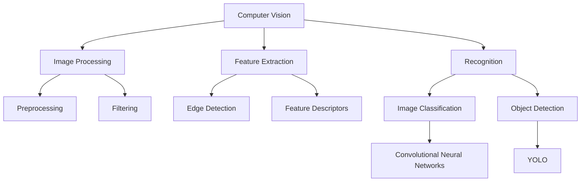

```mermaid
flowchart TD
    ComputerVision[Computer Vision] --> ImageProcessing[Image Processing]
    ComputerVision --> FeatureExtraction[Feature Extraction]
    ComputerVision --> Recognition[Recognition]
    ImageProcessing --> Preprocessing[Preprocessing]
    ImageProcessing --> Filtering[Filtering]
    FeatureExtraction --> Edges[Edge Detection]
    FeatureExtraction --> Descriptors[Feature Descriptors]
    Recognition --> Classification[Image Classification]
    Recognition --> Detection[Object Detection]
    Classification --> CNN[Convolutional Neural Networks]
    Detection --> YOLO[YOLO]
```