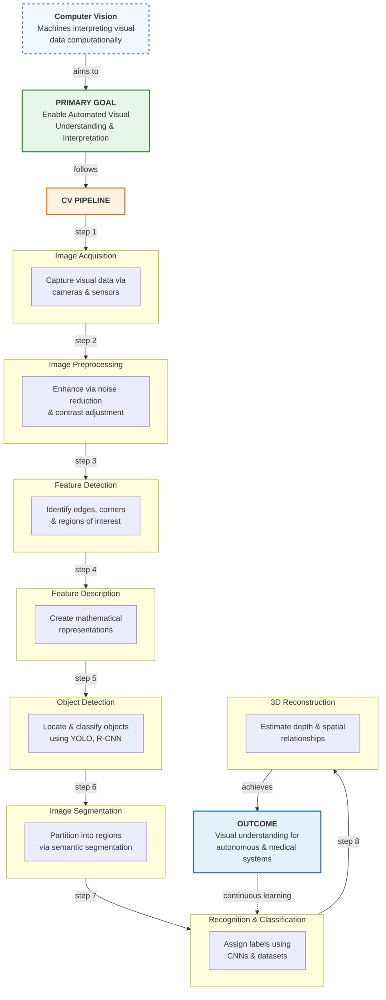

```mermaid
flowchart TD
    A[<b>Computer Vision</b><br>Machines interpreting visual<br>data computationally]:::title
    B[<b>PRIMARY GOAL</b><br>Enable Automated Visual<br>Understanding & Interpretation]:::goal
    C[<b>CV PIPELINE</b>]:::process
    
    subgraph D[Image Acquisition]
        D1[Capture visual data via<br>cameras & sensors]
    end
    
    subgraph E[Image Preprocessing]
        E1[Enhance via noise reduction<br>& contrast adjustment]
    end
    
    subgraph F[Feature Detection]
        F1[Identify edges, corners<br>& regions of interest]
    end
    
    subgraph G[Feature Description]
        G1[Create mathematical<br>representations]
    end
    
    subgraph H[Object Detection]
        H1[Locate & classify objects<br>using YOLO, R-CNN]
    end
    
    subgraph I[Image Segmentation]
        I1[Partition into regions<br>via semantic segmentation]
    end
    
    subgraph J[Recognition & Classification]
        J1[Assign labels using<br>CNNs & datasets]
    end
    
    subgraph K[3D Reconstruction]
        K1[Estimate depth & spatial<br>relationships]
    end
    
    L[<b>OUTCOME</b><br>Visual understanding for<br>autonomous & medical systems]:::outcome
    
    A -->|aims to| B
    B -->|follows| C
    C -->|step 1| D
    D -->|step 2| E
    E -->|step 3| F
    F -->|step 4| G
    G -->|step 5| H
    H -->|step 6| I
    I -->|step 7| J
    J -->|step 8| K
    K -->|achieves| L
    L -.->|continuous learning| J
    
    classDef title fill:#f0f7ff,stroke:#4a6fa5,stroke-width:2px,color:#333,stroke-dasharray:5 5
    classDef goal fill:#e8f5e9,stroke:#2e7d32,stroke-width:2px,color:#333
    classDef process fill:#fff3e0,stroke:#ef6c00,stroke-width:2px,color:#333
    classDef outcome fill:#e3f2fd,stroke:#1565c0,stroke-width:2px,color:#333
```