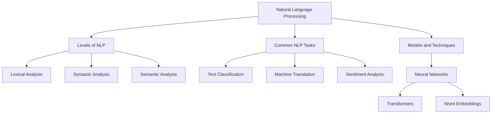

```mermaid
flowchart TD
    NaturalLanguageProcessing[Natural Language Processing] --> Levels[Levels of NLP]
    NaturalLanguageProcessing --> Tasks[Common NLP Tasks]
    NaturalLanguageProcessing --> Models[Models and Techniques]
    Levels --> Lexical[Lexical Analysis]
    Levels --> Syntactic[Syntactic Analysis]
    Levels --> Semantic[Semantic Analysis]
    Tasks --> Classification[Text Classification]
    Tasks --> Translation[Machine Translation]
    Tasks --> Sentiment[Sentiment Analysis]
    Models --> Neural[Neural Networks]
    Neural --> Transformers[Transformers]
    Neural --> WordEmbeddings[Word Embeddings]
```