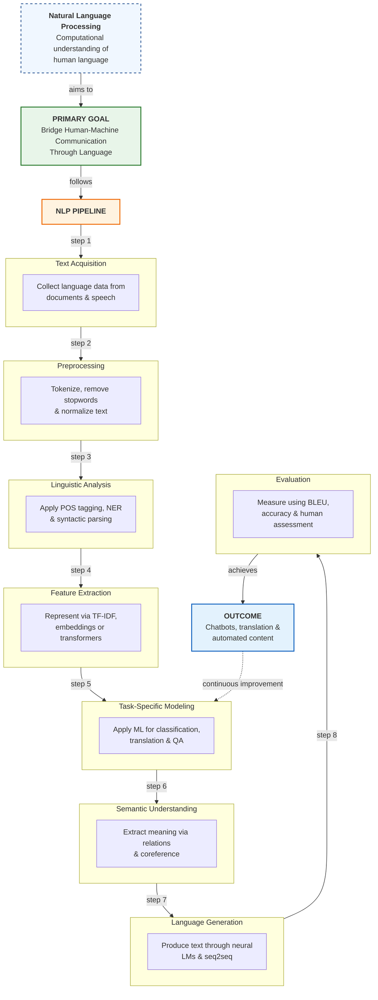

```mermaid
flowchart TD
    A[<b>Natural Language Processing</b><br>Computational understanding of<br>human language]:::title
    B[<b>PRIMARY GOAL</b><br>Bridge Human-Machine Communication<br>Through Language]:::goal
    C[<b>NLP PIPELINE</b>]:::process
    
    subgraph D[Text Acquisition]
        D1[Collect language data from<br>documents & speech]
    end
    
    subgraph E[Preprocessing]
        E1[Tokenize, remove stopwords<br>& normalize text]
    end
    
    subgraph F[Linguistic Analysis]
        F1[Apply POS tagging, NER<br>& syntactic parsing]
    end
    
    subgraph G[Feature Extraction]
        G1[Represent via TF-IDF,<br>embeddings or transformers]
    end
    
    subgraph H[Task-Specific Modeling]
        H1[Apply ML for classification,<br>translation & QA]
    end
    
    subgraph I[Semantic Understanding]
        I1[Extract meaning via relations<br>& coreference]
    end
    
    subgraph J[Language Generation]
        J1[Produce text through neural<br>LMs & seq2seq]
    end
    
    subgraph K[Evaluation]
        K1[Measure using BLEU,<br>accuracy & human assessment]
    end
    
    L[<b>OUTCOME</b><br>Chatbots, translation &<br>automated content]:::outcome
    
    A -->|aims to| B
    B -->|follows| C
    C -->|step 1| D
    D -->|step 2| E
    E -->|step 3| F
    F -->|step 4| G
    G -->|step 5| H
    H -->|step 6| I
    I -->|step 7| J
    J -->|step 8| K
    K -->|achieves| L
    L -.->|continuous improvement| H
    
    classDef title fill:#f0f7ff,stroke:#4a6fa5,stroke-width:2px,color:#333,stroke-dasharray:5 5
    classDef goal fill:#e8f5e9,stroke:#2e7d32,stroke-width:2px,color:#333
    classDef process fill:#fff3e0,stroke:#ef6c00,stroke-width:2px,color:#333
    classDef outcome fill:#e3f2fd,stroke:#1565c0,stroke-width:2px,color:#333
```