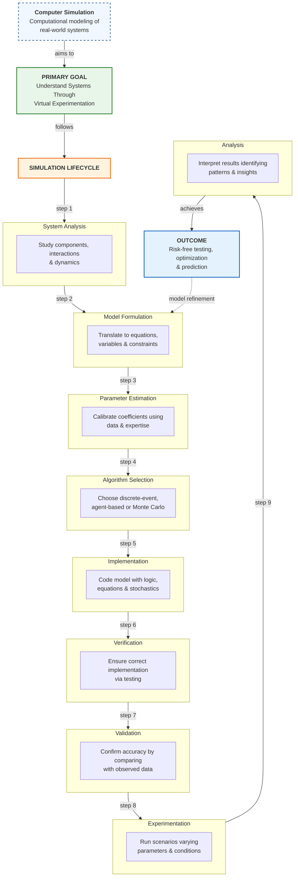

```mermaid
flowchart TD
    A[<b>Computer Simulation</b><br>Computational modeling of<br>real-world systems]:::title
    B[<b>PRIMARY GOAL</b><br>Understand Systems Through<br>Virtual Experimentation]:::goal
    C[<b>SIMULATION LIFECYCLE</b>]:::process
    
    subgraph D[System Analysis]
        D1[Study components, interactions<br>& dynamics]
    end
    
    subgraph E[Model Formulation]
        E1[Translate to equations,<br>variables & constraints]
    end
    
    subgraph F[Parameter Estimation]
        F1[Calibrate coefficients using<br>data & expertise]
    end
    
    subgraph G[Algorithm Selection]
        G1[Choose discrete-event,<br>agent-based or Monte Carlo]
    end
    
    subgraph H[Implementation]
        H1[Code model with logic,<br>equations & stochastics]
    end
    
    subgraph I[Verification]
        I1[Ensure correct implementation<br>via testing]
    end
    
    subgraph J[Validation]
        J1[Confirm accuracy by comparing<br>with observed data]
    end
    
    subgraph K[Experimentation]
        K1[Run scenarios varying<br>parameters & conditions]
    end
    
    subgraph L[Analysis]
        L1[Interpret results identifying<br>patterns & insights]
    end
    
    M[<b>OUTCOME</b><br>Risk-free testing, optimization<br>& prediction]:::outcome
    
    A -->|aims to| B
    B -->|follows| C
    C -->|step 1| D
    D -->|step 2| E
    E -->|step 3| F
    F -->|step 4| G
    G -->|step 5| H
    H -->|step 6| I
    I -->|step 7| J
    J -->|step 8| K
    K -->|step 9| L
    L -->|achieves| M
    M -.->|model refinement| E
    
    classDef title fill:#f0f7ff,stroke:#4a6fa5,stroke-width:2px,color:#333,stroke-dasharray:5 5
    classDef goal fill:#e8f5e9,stroke:#2e7d32,stroke-width:2px,color:#333
    classDef process fill:#fff3e0,stroke:#ef6c00,stroke-width:2px,color:#333
    classDef outcome fill:#e3f2fd,stroke:#1565c0,stroke-width:2px,color:#333
```
